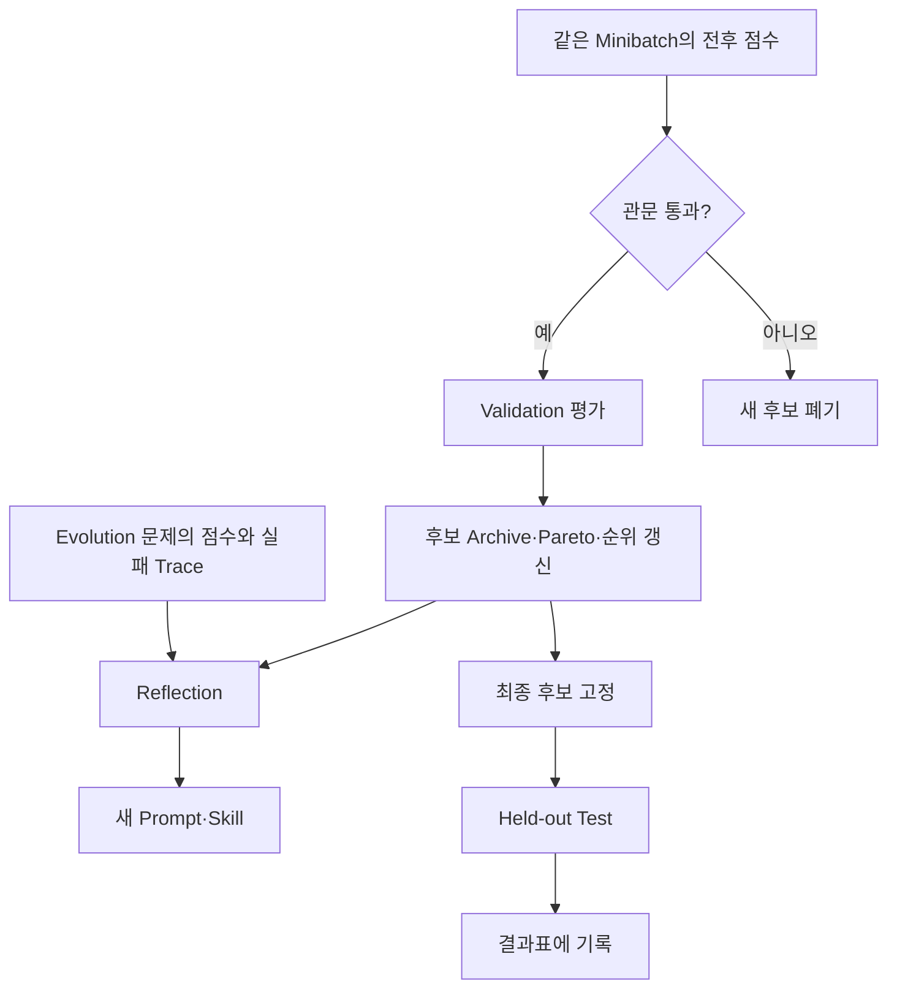
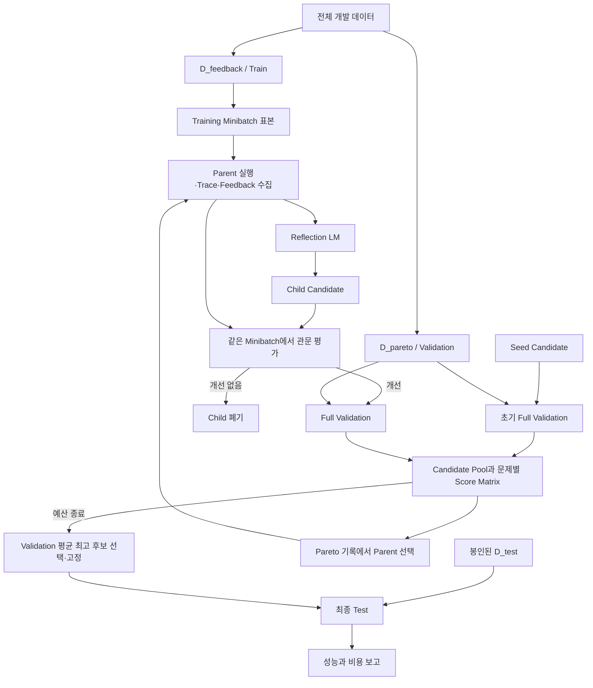

# 부록: Evolution 중 평가와 최종 Benchmark 평가 구분하기

> 대상 독자: [preliminaries.md](./preliminaries.md)를 읽었지만, prompt evolution 안에서 반복되는 평가와 논문에서 최종 성능을 측정하는 평가가 어떻게 다른지 헷갈리는 팀원  
> 모든 코드 블록은 실행 코드가 아니라 흐름을 설명하는 수도 코드다.
> DGM Figure 3의 node·색·archive와 실제 평가 순서는 [dgm.md](./dgm.md)에서 구체적으로 설명한다.

## 이 부록의 핵심 문장

같은 정답 검사기와 같은 accuracy를 사용하더라도, **그 점수가 다음 prompt를 고치는 데 쓰이는지, 후보를 고르는 데 쓰이는지, 결과표에 기록만 되는지**에 따라 평가의 역할이 달라진다.

```text
점수 → Prompt·Skill 수정                 = 진화를 위한 평가
점수 → 후보의 생존·순위·최종 선택        = Validation
점수 → 고정된 시스템의 결과표에 기록만   = Held-out Test
```

GEPA를 예로 들면 평가를 최소 네 단계로 나눠야 한다.

1. 부모 prompt를 training minibatch에서 실행하여 피드백을 얻는다.
2. 새 prompt를 **같은 minibatch**에서 다시 평가하여 값싸게 거른다.
3. 통과한 prompt를 별도의 validation set 전체에서 평가하여 후보를 관리한다.
4. 진화가 모두 끝난 뒤 고정된 prompt를 held-out test set에서 평가한다.

---

## 1. 왜 모두 똑같은 ‘평가’처럼 보이는가?

수학 문제라면 모든 단계에서 다음과 같은 동일한 verifier를 사용할 수 있다.

```text
VERIFY(모델의 최종 답, 정답):
    두 값이 같으면 1점
    다르면 0점
```

코드 문제라면 모든 단계에서 비슷한 테스트 실행기를 사용할 수 있다.

```text
VERIFY(제출한 Patch, 테스트 모음):
    Patch를 적용한다
    테스트를 실행한다
    필요한 테스트가 모두 통과하면 1점
    아니면 0점
```

채점 함수만 보면 차이가 없다. 차이는 **데이터와 점수의 행선지**에 있다.

| 확인할 질문 | 의미 |
|---|---|
| 어느 문제를 채점했는가? | Evolution, validation, test 중 어느 split인지 결정한다. |
| 누가 점수와 실패 내용을 보는가? | Reflection LLM, 후보 선택기, 연구자 중 누구에게 정보가 가는지 결정한다. |
| 점수를 본 뒤 무엇을 바꾸는가? | Prompt 수정, 후보 선택, 결과 기록 중 역할이 정해진다. |
| 같은 문제를 다시 풀 수 있는가? | 학습·재시도인지 최종 제출인지 결정한다. |

따라서 “정답 여부를 평가했다”만으로는 그 평가가 무슨 역할인지 알 수 없다.

---

## 2. `Runtime 평가`와 `Offline 평가`만으로 나누면 부족하다

`runtime`이라는 말은 단순히 프로그램이 실행되는 시간을 뜻하기도 하고, 실제 사용자 요청을 처리하는 inference time을 뜻하기도 한다. `offline`도 인터넷을 사용하지 않는다는 뜻이 아니라, 보통 배포 전에 저장된 데이터로 최적화하거나 평가한다는 뜻이다.

GEPA의 minibatch와 validation 평가도 당연히 프로그램이 실행되는 runtime에 발생한다. 동시에 둘 다 배포 전에 데이터셋으로 수행하는 **offline optimization**의 일부일 수 있다. 최종 benchmark 평가도 API를 실제로 호출하므로 프로그램은 실행되지만, 시스템을 수정하지 않는 **offline held-out evaluation**이다.

그러므로 다음 두 축을 따로 보아야 한다.

### 축 A: 언제 실행되는가?

- **Offline optimization**: 배포 전에 prompt나 skill을 개선한다.
- **Inference time**: 완성된 agent가 현재 사용자 문제를 처리한다.
- **Production monitoring**: 배포된 시스템의 성능과 실패를 수집한다.

### 축 B: 평가 결과를 무엇에 사용하는가?

- **Learning signal**: 실패를 읽고 자연어 요소를 수정한다.
- **Acceptance signal**: 새 후보가 최소 기준을 넘었는지 거른다.
- **Selection signal**: 후보를 보존·순위화하고 최종 후보를 고른다.
- **Reporting signal**: 고정된 시스템의 성능을 결과표에 기록한다.

두 축은 서로 독립적이다. 예를 들어 validation은 offline에 실행되지만 selection signal을 제공한다. Inference-time 검산은 runtime에 실행되지만 prompt evolution을 일으키지 않을 수도 있다.

이 문서에서는 모호한 `runtime evaluation` 대신 다음 용어를 사용한다.

| 권장 용어 | 뜻 |
|---|---|
| **문제 풀이 중 검증** | 현재 문제의 답을 고치거나 선택하기 위한 inference-time check |
| **진화 내부 평가** | 다음 prompt·skill을 만들기 위한 evolution-time evaluation |
| **미니배치 관문 평가** | 새 후보가 부모보다 나아졌는지 같은 작은 batch에서 확인 |
| **개발 Validation** | 후보 보존, Pareto 관리, 최종 후보 선택에 사용 |
| **최종 Held-out Test** | 시스템을 고정한 뒤 일반화 성능을 보고 |
| **배포 후 Monitoring** | 실제 사용 기록을 수집하는 과정이며, 즉시 진화하는 것과는 별개 |

---

## 3. 연습문제, 모의고사, 봉인된 기말고사 비유

한 학생이 자신만의 수학 풀이 노트를 계속 개선한다고 생각해 보자.

| 비유 | Prompt evolution에서의 의미 |
|---|---|
| 풀이 노트 | Prompt 또는 skill 후보 |
| 정답지 | Verifier |
| 오늘 뽑은 연습문제 3개 | Training minibatch |
| 오답과 해설을 보고 노트를 수정 | Reflection과 mutation |
| 같은 3문제를 새 노트로 다시 풀기 | Minibatch 관문 평가 |
| 여러 차례 보는 모의고사 | Validation set 평가 |
| 마지막까지 봉인한 기말고사 | Held-out test set 평가 |

학생은 연습문제에서 틀린 이유를 읽고 풀이 노트에 다음 규칙을 추가할 수 있다.

```text
양변을 제곱한 경우, 마지막에 후보 해를 원래 식에 대입하라.
```

이는 **학습을 위한 평가**다. 새 노트가 방금 연습한 세 문제에서 좋아졌는지는 같은 세 문제로 빠르게 확인할 수 있다. 하지만 세 문제에만 맞춘 규칙일 수 있으므로 이것만으로 전체 성능 향상을 주장할 수 없다.

더 넓은 모의고사에서 여러 풀이 노트를 비교하고 어떤 노트를 계속 사용할지 정한다. 이것이 validation이다. 모의고사는 연습문제의 상세 해설처럼 직접 노트를 고치는 데 쓰지 않더라도, 어떤 노트가 살아남는지를 결정하므로 진화에 간접적으로 영향을 준다.

모든 수정과 선택이 끝나면 노트를 하나로 고정한다. 봉인된 기말고사를 풀고 점수만 기록한다. 이 점수를 보고 다시 노트를 고친다면 그 시험지는 더 이상 봉인된 최종 시험이 아니다.

---

## 4. 가장 중요한 구분: 점수가 어디로 흘러가는가?



위 그림에서 차이는 역방향 화살표다.

- Evolution과 validation 결과는 다시 search loop로 돌아간다.
- Test 결과는 보고서로만 가야 한다.

이 원칙을 한 질문으로 검사할 수 있다.

> **이 점수를 본 뒤 prompt, skill, memory, 후보, 설정 또는 최종 답이 바뀌었는가?**

답이 “예”라면 그 평가는 최종 test가 아니다. 학습, 검색, 선택 또는 inference 절차의 일부다.

---

## 5. GEPA의 데이터 세 부분

GEPA 논문의 Algorithm 1은 최적화에 사용하는 데이터를 `D_feedback`과 `D_pareto`로 구분한다. 실험에서는 일반적인 train/validation/test 용어와 다음처럼 대응한다.

| GEPA 표기 | 일반적인 이름 | 역할 |
|---|---|---|
| `D_feedback` | Train / Evolution set | Minibatch를 뽑아 trace와 구체적 피드백을 얻고 prompt를 수정한다. |
| `D_pareto` | Validation set | 후보별 문제 단위 점수를 기록하고 Pareto selection과 최종 후보 선택에 사용한다. |
| `D_test` | Held-out test set | Algorithm 1 바깥에서 고정된 최종 후보의 일반화 성능을 측정한다. |

`D_feedback`에서는 reflection LLM이 입력, 모델 출력, 실패 원인, 정답 관련 피드백 등을 읽을 수 있다. 이 정보가 새 prompt 문장을 만드는 직접적인 학습 신호다.

`D_pareto`에서는 후보별 점수가 selection에 사용된다. GEPA 논문의 표준 실험에서는 validation instance의 내용과 trace를 reflection의 prompt 수정 자료로 직접 제공하지 않고, validation score를 후보 관리에 사용한다. 그러나 점수가 다음 parent와 최종 prompt 선택에 영향을 주므로 validation도 최적화 loop의 일부다.

`D_test`의 결과는 prompt 수정이나 후보 선택으로 되돌아가지 않아야 한다.

---

## 6. GEPA 한 번의 반복을 정확히 따라가기

### 6.1 시작: Seed prompt의 validation 기록

GEPA는 초기 seed candidate를 validation set에서 평가하여 문제별 점수를 저장한다.

```text
Seed P0의 Validation 점수 벡터
문제 V1: 1점
문제 V2: 0점
문제 V3: 1점
...
```

평균 점수만 저장하는 것이 아니라 각 validation example에서 어떤 후보가 잘했는지를 추적할 수 있는 점수 벡터가 중요하다.

### 6.2 Parent 후보 선택

후보가 여러 개 쌓이면 GEPA는 validation 문제마다 가장 잘한 후보들을 찾는다. 어떤 후보는 대수 문제에서, 다른 후보는 기하 문제에서 최고일 수 있다. 이런 후보 집합에서 다음에 발전시킬 parent를 고른다.

이 selection은 validation 점수에 의존한다. 따라서 validation은 prompt rewrite의 직접 재료가 아니더라도 search 방향에 영향을 준다.

### 6.3 Training minibatch에서 Parent 실행

`D_feedback`에서 작은 minibatch를 뽑는다. GEPA 논문의 기본 실험에서는 minibatch 크기 3을 사용했다.

```text
Minibatch M = [연습문제 T7, T24, T81]
```

Parent prompt로 세 문제를 풀어 다음을 수집한다.

- 문제별 정답 점수
- 생성된 풀이와 중간 실행 trace
- Parser 오류나 compiler 오류 같은 평가 trace
- 가능하다면 자연어 형태의 구체적 feedback

### 6.4 Reflection으로 Child prompt 생성

Reflection LLM이 parent prompt와 minibatch의 실행 기록을 읽고 수정된 child prompt를 만든다.

```text
Parent P0:
문제를 단계적으로 풀고 답을 명시하라.

관찰된 실패:
무리방정식에서 제곱 후 생긴 무연근을 제거하지 않았다.

Child P1:
식을 변형하여 새로운 후보 해가 생길 수 있다면,
모든 후보를 원래 식과 조건에 대입해 검증하라.
```

여기가 실제 자연어 학습이 일어나는 단계다.

### 6.5 같은 Minibatch에서 Child 재평가

새 child를 **방금 사용한 동일한 minibatch**에서 다시 실행한다. Parent와 child가 같은 문제를 풀어야 전후 비교가 가능하다.

```text
Parent P0: 1 / 3
Child  P1: 3 / 3
```

현재 GEPA의 기본 acceptance criterion은 minibatch 점수 합이 엄격히 좋아질 때 child를 통과시키는 방식이다. 원 논문 Algorithm 1은 평균 점수의 개선으로 표현하는데, 같은 크기의 minibatch를 비교할 때 합과 평균의 대소 관계는 같다. 설정에 따라 다른 관문 규칙을 사용할 수도 있다.

공식 문서에서는 이 단계를 `minibatch validation`이라고 부르기도 한다. 이 표현에서 validation은 **새 mutation이 좋아졌는지 확인한다**는 일상적인 뜻이다. 일반적인 ML의 **validation split을 사용한다는 뜻이 아니다**.

이 부록에서는 혼동을 피하기 위해 이 단계를 **미니배치 관문 평가**라고 부른다.

### 6.6 통과한 Child만 Full Validation

Child가 minibatch 관문을 통과하면 별도 `D_pareto`, 즉 validation set 전체에서 평가한다.

```text
P1의 Validation 점수 벡터를 계산
→ Candidate pool에 P1 추가
→ 문제별 최고 후보와 Pareto 기록 갱신
→ 이후 Parent 선택 확률에 반영
```

작은 minibatch에서 나빠진 후보까지 매번 전체 validation에서 실행하면 API 비용이 커진다. Minibatch 관문은 가능성이 낮은 후보를 값싸게 제거하는 필터다.

### 6.7 예산 종료 후 최종 후보 선택

진화 예산이 끝나면 GEPA의 표준 설정은 validation 평균 점수가 가장 높은 단일 candidate를 반환한다. Pareto archive 전체가 자동으로 하나의 최종 agent가 되는 것은 아니다.

Archive 전체를 inference-time ensemble처럼 사용하려면 후보 선택·투표·비용을 포함한 별도의 시스템과 평가 조건이 필요하다.

### 6.8 최종 Held-out Test

최종 candidate와 모든 실행 설정을 고정한 뒤, evolution이나 candidate selection에 한 번도 쓰지 않은 test set에서 평가한다.

```text
고정할 것:
- 모델과 모델 버전
- 최종 Prompt·Skill
- Memory 초기 상태
- 문제당 호출 횟수
- Temperature와 출력 길이
- Tool 사용 규칙
- 후보 생성·선택 규칙
- Answer parser와 verifier
```

Test 점수는 결과표에 기록하며 search loop로 되돌리지 않는다.

“마지막에 한 번 평가한다”는 말은 문제마다 API를 딱 한 번만 호출한다는 뜻이 아니다. 확률적 변동을 측정하기 위해 문제당 5회 반복처럼 **미리 정한 test protocol**을 사용할 수 있다. 중요한 점은 반복 횟수와 집계 방식을 test 결과를 보기 전에 고정하고, 반복 사이에 prompt를 수정하거나 가장 잘 나온 실행만 선택하지 않는 것이다.

---

## 7. GEPA 전체 흐름도



핵심 화살표를 말로 다시 쓰면 다음과 같다.

```text
Training minibatch의 상세 실패 → 새 Prompt 작성
같은 minibatch의 전후 점수     → 값싼 통과·탈락
Validation의 문제별 점수       → Archive·Parent·최종 후보 선택
Test 점수                       → 논문·발표 결과표
```

---

## 8. 숫자로 보는 하나의 가상 반복

수학 문제 160개를 다음처럼 나눴다고 하자.

```text
D_feedback / Train: 100문제
D_pareto / Validation: 30문제
D_test / Final Test: 30문제
Minibatch 크기: 3문제
```

### 단계 A: Minibatch 피드백

현재 parent `P4`가 세 연습문제에서 다음 결과를 냈다.

```text
T7  = 정답
T24 = 오답: 양의 정수 조건 누락
T81 = 오답: 경우 중복 계산
Parent 점수 = 1 / 3
```

Reflection LLM은 두 실패를 읽고 child `P5`를 만든다.

### 단계 B: Minibatch 관문

같은 세 문제를 `P5`로 다시 푼다.

```text
P4 = 1 / 3
P5 = 3 / 3
```

`P5`는 관문을 통과한다. 그러나 `3/3`은 전체 수학 성능이 100%라는 뜻이 아니다. P5를 만들 때 이미 사용한 세 문제에서의 국소적인 결과다.

### 단계 C: Full Validation

`P5`를 validation 30문제에서 평가한다.

```text
P4 = 19 / 30
P5 = 21 / 30
```

문제별 점수 벡터를 archive에 저장한다. 평균은 P5가 높지만, P4가 유일하게 맞힌 몇몇 문제가 있을 수 있어 둘 다 이후 search의 stepping stone으로 남을 수 있다.

### 단계 D: 최종 Test

여러 반복이 끝난 뒤 validation으로 최종 prompt `P12`를 선택하고 고정한다.

```text
P12의 Final Test = 20 / 30
```

논문에서 일반화 성능으로 보고해야 할 값은 `3/3`이나 validation의 최고 점수가 아니라, 원칙적으로 봉인된 test에서 얻은 `20/30`이다.

`20/30`의 실패 문제를 본 뒤 P13을 만들었다면 기존 test는 이제 개발 데이터가 되었다. P13의 최종 성능을 주장하려면 새로운 held-out test가 필요하다.

---

## 9. 네 단계 비교표

| 단계 | 데이터 | 결과를 누가 사용하는가? | 결과 이후 변화 | 최종 성능으로 보고 가능한가? |
|---|---|---|---|---:|
| Parent minibatch 실행 | `D_feedback` 일부 | Reflection LLM | Child prompt 생성 | 아니오 |
| Child minibatch 관문 | 같은 `D_feedback` 일부 | Acceptance logic | Child 통과·폐기 | 아니오 |
| Full validation | `D_pareto` 전체 | Pareto·selection logic | Archive, 다음 parent, 최종 후보 변경 | 아니오 |
| Held-out test | `D_test` | 연구자와 결과 기록기 | 시스템 변화 없음 | 예 |

Validation은 train과 분리되어 있지만 최종 test와 같지 않다. 반복적으로 후보 선택에 사용되기 때문에 validation 분포와 우연한 특성에 search가 간접적으로 적응할 수 있다.

---

## 10. GEPA의 Pareto는 Validation 점수를 어떻게 사용하는가?

초보자는 Pareto archive를 “평균 점수가 높은 prompt 목록”으로 생각하기 쉽다. GEPA의 기본적인 instance-wise 방식은 각 validation 문제를 하나의 key처럼 보고, 해당 문제에서 최고 점수를 낸 후보를 추적한다.

다음은 단순화한 예다.

| Validation 문제 | P1 | P2 | P3 | 그 문제의 최고 후보 |
|---|---:|---:|---:|---|
| 대수 V1 | 1 | 1 | 0 | P1, P2 |
| 기하 V2 | 0 | 1 | 1 | P2, P3 |
| 조합 V3 | 1 | 0 | 1 | P1, P3 |
| 정수 V4 | 0 | 0 | 1 | P3 |

- P1은 V1, V3에서 최고다.
- P2는 V1, V2에서 최고다.
- P3는 V2, V3, V4에서 최고다.

이 기록은 서로 다른 문제에서 강한 후보를 다음 parent로 선택할 기회를 준다. 따라서 validation의 각 문제 점수는 단순 보고값이 아니라 exploration 경로를 결정하는 selection signal이다.

또한 `valset Pareto frontier score`는 각 validation 문제에 대해 사후적으로 가장 잘한 후보를 고른 oracle 성격의 값일 수 있다. 하나의 고정 prompt가 그대로 그 점수를 낸다는 뜻은 아니다. 실제 배포에서 여러 prompt 중 무엇을 고를지 모른다면 단일 최종 candidate 점수와 구분해서 보고해야 한다.

---

## 11. GEPA AIME 실험에 실제로 대입하기

GEPA 논문의 AIME 실험은 다음처럼 나뉜다.

| 데이터 | 문항 수 | 역할 |
|---|---:|---|
| AIME 2022–2024 | 총 90문항 중 45 | `D_feedback`: minibatch reflection과 prompt 수정 |
| AIME 2022–2024 | 나머지 45 | `D_pareto`: validation과 후보 선택 |
| AIME 2025 | 30문항 | 최종 test, 각 문항을 5회 반복 평가 |

GEPA 최적화 실험의 minibatch 크기는 3이었다. 따라서 AIME 2025 성능을 개선하기 위해 AIME 2025 정답과 실패 trace를 reflection에 넣은 것이 아니다.

```text
AIME 2022–2024 Train 일부
→ 구체적인 오답 피드백으로 Prompt 수정

AIME 2022–2024 Validation
→ 후보의 Pareto와 최종 Prompt 선택

AIME 2025
→ 선택이 끝난 Prompt의 일반화 성능 측정
```

논문에서 validation curve와 test-set marker가 따로 나오는 이유도 여기에 있다. Search가 직접 보고 선택한 validation 성능과, 마지막까지 선택에 쓰지 않은 test 성능은 질문이 다르다.

---

## 12. 표준적인 Offline Prompt Evolution

GEPA를 수학 prompt 최적화에 사용하는 표준적인 형태는 보통 **배포 전 offline optimization**이다.

```text
[배포 전]
Train minibatch와 Validation으로 Prompt 진화
→ 최종 Prompt 선택
→ Prompt와 Agent 설정 고정

[배포 또는 Held-out Test]
새 문제 입력
→ 고정된 Agent가 문제 해결
→ 최종 답 제출
```

이때 test 문제를 풀면서 GEPA가 계속 prompt를 고치는 것은 아니다. 따라서 “GEPA는 self-evolving이므로 test 중에도 매 문제 스스로 prompt를 바꾼다”는 설명은 정확하지 않다.

모델 가중치는 고정되어 있어도 offline 단계에서 prompt가 진화하므로 시스템은 개선된다. Test 단계에서는 그 결과물을 고정하여 일반화 여부를 측정한다.

---

## 13. 문제 풀이 중 검증은 별개의 축이다

완성된 agent가 한 문제를 푸는 동안 답을 검산할 수도 있다.

```text
후보 풀이 생성
→ 원래 식에 대입
→ 조건 위반 발견
→ 같은 문제를 다시 계산
→ 최종 답 제출
```

이는 **inference-time verification**이다. 같은 실행 안에서 현재 답을 고치지만, 다음 문제에도 남을 prompt나 skill 파일을 바꾸지 않는다면 persistent self-evolution은 아니다.

Inference time에 사용할 수 있는 정보는 실제 상황에서 접근 가능한 것이어야 한다.

| 검증 방법 | 현재 답 수정에 사용 가능? | 이유 |
|---|---:|---|
| 방정식 후보 해를 원래 식에 대입 | 가능 | 공식 정답 없이 조건을 직접 검사한다. |
| 서로 독립적인 두 풀이의 답 비교 | 가능 | 생성된 후보 사이의 일관성을 검사한다. |
| 공개된 코드 unit test 실행 | 가능 | agent에게 허용된 tool이다. |
| Test set 공식 정답과 비교 후 재시도 | 불가능 | 봉인된 정답표를 보고 시험을 다시 푸는 것과 같다. |
| 숨겨진 SWE-bench 평가 테스트 결과를 반복 조회 | 표준 평가에서는 불가능 | 최종 evaluation 정보를 풀이 과정에 사용한다. |

Benchmark harness는 모델 제출 뒤 공식 정답을 알고 채점할 수 있다. 하지만 그 정답이나 정오 신호를 agent에게 돌려주어 같은 test 문제를 다시 풀게 하면 평가 protocol이 달라진다.

### AIME 예시

```text
허용 가능한 문제 풀이 중 검증:
구한 수를 원래 조건에 대입한다.

최종 offline 평가:
제출이 끝난 뒤 harness가 공식 답과 비교한다.

Leakage:
Harness가 "틀렸다"고 알려 주고 정답이 나올 때까지 같은 문제를 재시도한다.
```

### SWE-bench 예시

Coding agent가 저장소에 원래 들어 있던 공개 테스트를 실행하며 patch를 수정하는 것은 agent runtime의 일부가 될 수 있다. 최종 evaluation harness가 별도로 적용하는 평가 테스트는 최종 patch의 resolved 여부를 판단하는 용도다. 어떤 테스트를 agent에게 공개했는지 반드시 기록해야 한다.

---

## 14. Inference-time Search와 Online Evolution

### 14.1 Inference-time Search

현재 문제 하나를 위해 여러 후보를 만들고, 허용된 실행 피드백을 이용해 더 나은 답을 찾는 방법이다.

```text
현재 문제
→ 후보 A 생성·검사
→ 후보 B 생성·검사
→ 후보 C 생성·검사
→ 최종 후보 선택
```

GEPA 논문은 코드 최적화에서 validation set을 target training set과 같게 두는 inference-time search도 별도 실험한다. 이 경우 목표는 여러 미래 문제에 일반화할 하나의 prompt를 학습하는 것보다, 현재 target의 실행 성능을 반복적으로 개선하는 데 가깝다.

이를 표준 train/validation/test prompt optimization과 같은 결과로 해석하면 안 된다. 현재 target에서 여러 번 실행하고 피드백을 받는 비용 전체가 inference budget이다.

### 14.2 Online Evolution

실제 문제를 순서대로 처리하며 앞 문제에서 얻은 피드백을 다음 문제의 memory나 skill에 저장할 수 있다.

```text
문제 1을 현재 Agent로 먼저 풀이하고 점수 기록
→ 문제 1의 피드백 공개
→ Memory·Skill 업데이트
→ 문제 2를 업데이트된 Agent로 풀이하고 점수 기록
→ 문제 2의 피드백 공개
→ 다음 문제로 진행
```

이 평가에서는 문제 순서와 피드백 공개 시점이 연구 조건이다. 현재 문제의 정답을 먼저 본 뒤 agent를 수정하고 같은 문제의 점수를 “첫 시도 성능”으로 기록해서는 안 된다.

따라서 “runtime에 진화한다”라고만 쓰지 말고 다음을 명시한다.

- 변화가 현재 문제 안에서만 유지되는가?
- 변화가 다음 문제에도 저장되는가?
- 정답이나 테스트 피드백은 언제 공개되는가?
- 현재 문제를 몇 번까지 다시 시도하는가?
- 각 문제에 사용한 총 호출과 토큰은 얼마인가?

---

## 15. 전체 수도 코드

```text
feedback_set, validation_set, test_set = 데이터를 처음에 한 번 분할

candidate_pool = [seed_prompt]
seed의 validation 문제별 점수를 기록

while evolution_budget이 남아 있음:
    parent = validation 기록과 Pareto를 이용해 후보 하나 선택
    minibatch = feedback_set에서 작은 문제 묶음 선택

    parent_run = parent로 minibatch를 풀고
                 점수 + 실행 trace + 상세 feedback 수집

    child = reflection_LLM이 parent_run을 읽고 새 prompt 생성
    child_run = child로 동일한 minibatch를 다시 풀고 채점

    if child가 minibatch 관문을 통과하지 못함:
        child를 폐기
        다음 반복으로 이동

    child_val_scores = child를 validation_set 전체에서 채점
    candidate_pool과 Pareto 기록을 갱신

final_prompt = validation 평균으로 단일 후보 선택
모델·prompt·skill·memory 초기값·호출 규칙을 모두 고정

final_test_score = final_prompt를 test_set에서 평가
final_test_score와 비용을 결과표에 기록

# Test 결과에서 reflection으로 돌아가는 화살표가 없어야 한다.
```

Verifier 코드는 세 데이터 split에서 같아도 된다.

```text
score = VERIFY(prediction, reference)
```

달라지는 것은 다음 줄이다.

```text
Train score      → REFLECT_AND_MUTATE()
Validation score → SELECT_AND_ARCHIVE()
Test score       → REPORT_ONLY()
```

---

## 16. 자주 생기는 혼동

| 혼동 | 정확한 설명 |
|---|---|
| 채점기가 같으면 모두 같은 평가다. | 데이터와 점수의 사용 목적이 다르면 역할도 다르다. |
| Minibatch에서 3/3이면 성능이 100%다. | 후보를 만든 소수 문제에서의 국소적인 결과일 뿐이다. |
| GEPA의 `minibatch validation`은 validation set 평가다. | 동일한 training minibatch에서 parent와 child를 비교하는 관문이다. |
| Validation은 prompt 문장을 직접 고치지 않으므로 최적화와 무관하다. | Parent, archive, 최종 prompt 선택에 쓰이므로 간접적인 최적화 신호다. |
| Validation은 train과 분리됐으므로 최종적으로 완전히 unseen이다. | 반복 selection에 사용되어 validation에 과적합할 수 있다. |
| Pareto archive 점수가 곧 한 prompt의 성능이다. | 문제마다 다른 최고 후보를 고른 oracle 값일 수 있으므로 단일 후보 점수와 구분해야 한다. |
| Test 문제를 prompt 안에 넣지 않으면 여러 번 점수를 봐도 된다. | Test 결과를 보고 후보나 설정을 바꾸는 순간 test에 적응한 것이다. |
| `Offline`은 API나 인터넷을 쓰지 않는다는 뜻이다. | 배포 전 저장된 데이터로 최적화·평가한다는 절차적 의미이며 API를 사용할 수 있다. |
| 같은 문제 안에서 답을 재검산하면 self-evolution이다. | 미래 문제에 남는 prompt·skill·memory가 변하지 않으면 inference-time correction이다. |
| 모델 가중치를 고정했으므로 시스템도 고정됐다. | Prompt, skill, memory, 호출 수, tool, selection logic이 바뀌면 agent 시스템은 달라진다. |
| Test에서 가장 잘 나온 seed만 보고하면 된다. | Test를 model selection에 사용한 것이므로 새로운 held-out set이 필요하다. |

---

## 17. 우리 프로젝트에서 권장하는 이름

실험 코드, 표, 발표 자료에서 `eval score` 또는 `runtime score`라고만 적지 않는다. 다음처럼 구체적으로 이름을 붙인다.

| 변수·표 이름 예시 | 의미 |
|---|---|
| `evolution_minibatch_score` | Parent 실행과 reflection을 위한 train minibatch 점수 |
| `minibatch_acceptance_score` | 같은 batch에서 child가 parent를 넘었는지 보는 점수 |
| `validation_selection_score` | Archive와 최종 후보 선택에 쓰는 validation 점수 |
| `heldout_test_score` | 고정된 시스템의 최종 보고 점수 |
| `inference_verification_result` | 현재 문제를 제출하기 전 수행한 검산 결과 |
| `production_monitoring_metric` | 배포 뒤 관찰한 운영 지표 |

보고서에는 다음 문장을 명시할 수 있다.

> Evolution minibatch의 피드백은 prompt mutation에 사용했다. 별도의 validation set은 candidate archive와 최종 prompt 선택에만 사용했다. 최종 prompt와 모든 inference 설정을 고정한 뒤 held-out test를 평가했으며, test 결과는 추가 수정이나 선택에 사용하지 않았다.

---

## 18. 실험 전 확인 질문

### 데이터 역할

- Evolution, validation, test 문제 ID를 처음부터 분리했는가?
- 번역본, 숫자만 바꾼 문제, 같은 원본 문제가 split을 넘어 중복되지 않는가?
- Test 정답이나 실패 사례를 팀원이 prompt 작성 중에 보지 않았는가?

### 정보 흐름

- Reflection LLM이 어느 split의 trace와 정답 피드백을 보는가?
- Validation 결과가 parent 선택과 archive에 어떻게 들어가는가?
- Test 점수에서 evolution loop로 돌아가는 코드 경로가 없는가?

### Inference 조건

- 문제당 호출 횟수와 후보 수가 고정되어 있는가?
- Agent가 사용할 수 있는 verifier와 tool이 명시되어 있는가?
- 공식 정답이 최종 제출 전에 agent에게 노출되지 않는가?
- Baseline과 evolved method의 호출·토큰 예산이 같은가?

### 기록

- 모든 prompt, skill, 모델 설정과 데이터 split을 버전으로 저장했는가?
- Minibatch, validation, test 점수를 서로 다른 필드에 기록하는가?
- 최종 점수와 함께 호출 수, 토큰, 비용, 실행 날짜를 남기는가?

---

## 19. 한 페이지 요약

| 구분 | 연습문제 피드백 | Minibatch 관문 | Validation | Final Test | Inference-time 검산 |
|---|---|---|---|---|---|
| 주된 목적 | 실패 이해·수정 | 값싼 후보 선별 | 후보 관리·선택 | 일반화 성능 보고 | 현재 답 개선 |
| 데이터 | Train 일부 | 같은 Train 일부 | Validation 전체 | 봉인된 Test | 현재 사용자 문제 |
| 상세 실패를 Prompt 수정에 사용 | 예 | 보통 전후 점수 중심 | GEPA 표준 protocol에서는 아니오 | 아니오 | 현재 답에는 사용 가능 |
| 미래 Prompt·Skill에 영향 | 직접 | 통과 여부로 영향 | 선택을 통해 간접 영향 | 없어야 함 | 저장하지 않으면 없음 |
| 같은 문제 재시도 | 예 | 예 | 후보별 실행 | 최종 protocol에 따름 | 허용된 예산 안에서 가능 |
| 논문의 최종 성능 | 아니오 | 아니오 | 아니오 | 예 | Test protocol에 포함해 함께 보고 |

마지막으로 다음 세 문장만 기억해도 된다.

1. **Minibatch는 새 아이디어를 만들고 빠르게 거르는 연습문제다.**
2. **Validation은 어떤 아이디어를 살려 둘지 정하는 모의고사다.**
3. **Held-out test는 모든 선택이 끝난 뒤 점수만 기록하는 봉인된 시험이다.**

최종 test 전에 고정해야 하는 것은 모델 가중치만이 아니다. **모델 버전, prompt, skill, memory 초기 상태, 호출 횟수, 생성 설정, 답 선택법, tool 사용법, parser와 verifier까지 모두 고정해야 한다.**

---

## 참고 자료

- [GEPA: Reflective Prompt Evolution Can Outperform Reinforcement Learning — ICLR 2026 논문](https://proceedings.iclr.cc/paper_files/paper/2026/file/0e9e708b6f48e14fd0ac29e167413f76-Paper-Conference.pdf): Algorithm 1·2, train/validation/test protocol, AIME split
- [GEPA 공식 FAQ](https://gepa-ai.github.io/gepa/guides/faq/): 한 iteration의 minibatch evaluation, reflection, minibatch validation, full validation 순서
- [GEPA 공식 Batch Sampling 안내](https://gepa-ai.github.io/gepa/guides/batch-sampling/): `D_feedback` minibatch가 reflection에 들어가는 방식
- [GEPA 공식 Acceptance Criterion 안내](https://gepa-ai.github.io/gepa/guides/acceptance-criterion/): 같은 minibatch에서 새 후보를 통과시키는 기준
- [GEPA 공식 Candidate Selection 안내](https://gepa-ai.github.io/gepa/guides/candidate-selection/): validation example별 Pareto 기록과 parent 선택 방식
