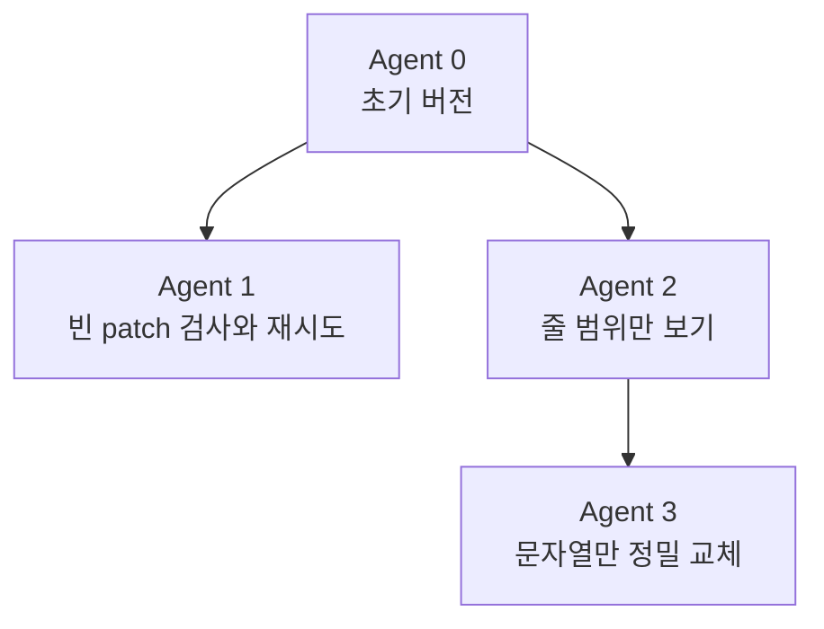
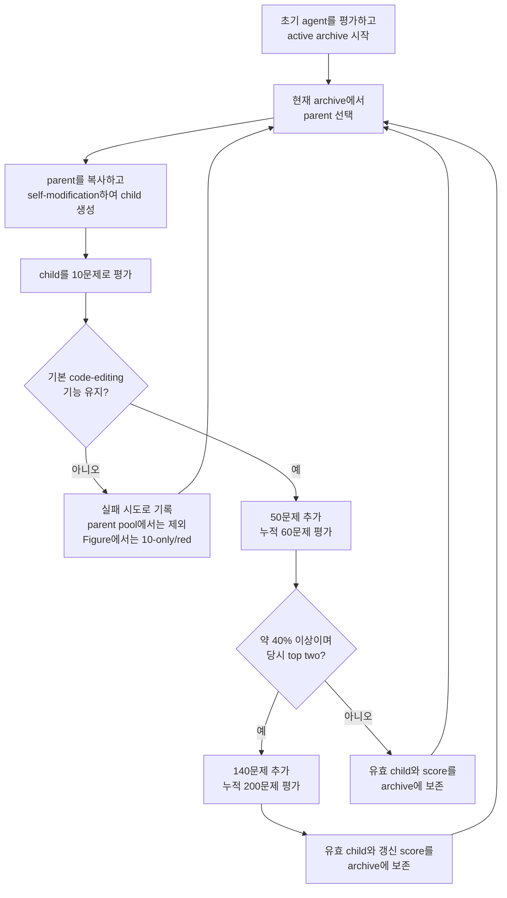
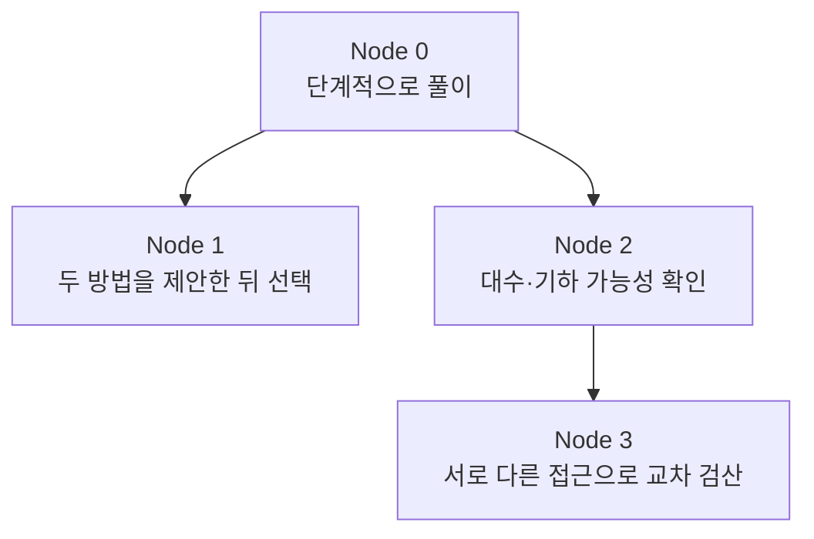

# DGM Archive Tree 읽기: 진화 계보와 평가 과정

> 대상 독자: LLM과 coding agent를 처음 접하는 팀원  
> 대상 그림: *Darwin Gödel Machine* 논문 Figure 3의 왼쪽 `DGM Archive Tree`  
> 먼저 읽을 자료: [preliminaries.md](./preliminaries.md)  
> 평가 용어를 더 엄밀히 구분하려면: [appendix.md](./appendix.md)

## 이 그림을 한 문장으로 설명하면

> **DGM Archive Tree는 coding agent 버전들의 가계도와 성적표를 한 그림에 합친 것이다.** 원 하나는 agent 한 버전이고, 선은 어떤 부모를 수정해 자식을 만들었는지를 나타내며, 원 안쪽 색은 성능, 테두리 색은 평가한 문제 수를 나타낸다.

가장 먼저 바로잡아야 할 오해가 있다.

> **DGM은 tree를 전부 만든 다음 한꺼번에 평가하지 않는다. 또한 같은 depth의 node를 모두 만든 뒤 다음 depth로 넘어가지도 않는다.**

실제 실행에서는 다음 과정이 계속 반복된다.

```text
현재 archive에서 parent 선택
→ parent를 복사하고 수정하여 child 생성
→ 방금 만든 child를 즉시 단계적으로 평가
→ 기능을 유지한 child만 active archive에 추가
→ 갱신된 archive에서 다음 parent 선택
→ 반복
```

우리가 보는 tree 그림은 이 과정을 모두 마친 뒤 누적된 기록으로 그린 **사후 시각화**다. 그림은 마지막에 그려지지만, 그림 속 평가는 evolution 도중 child가 생길 때마다 이루어졌다.

---

## 1. DGM은 무엇의 성능을 높였는가?

DGM의 목표는 SWE-bench 같은 coding benchmark를 더 잘 푸는 **coding agent**를 자동으로 개선하는 것이다.

여기서 coding agent는 LLM 하나만 뜻하지 않는다. 대략 다음을 합친 실행 시스템이다.

- 문제를 읽고 LLM에 전달하는 prompt
- 저장소의 파일을 살펴보는 도구
- 파일을 수정하는 도구
- shell 명령과 test를 실행하는 도구
- 긴 context를 관리하는 방법
- patch를 한 번 또는 여러 번 생성하는 workflow
- 여러 patch를 비교하여 하나를 선택하는 방법

DGM의 한 실험에서 **평가 대상 coding agent의 foundation model은 고정**하고, 그 모델을 둘러싼 **agent 코드, tool, prompt, context 관리 방식, workflow**를 수정한다. 별도의 diagnostic FM이 평가 log에서 개선안을 제안하는 단계는 있지만, node 사이의 차이는 model weight를 재학습한 결과가 아니다. 따라서 이 그림은 새로 학습한 여러 LLM의 가계도가 아니다.

SWE-bench에서 agent는 보통 다음과 같은 일을 한다.

```text
GitHub issue와 code repository를 받는다.
→ 관련 파일을 찾는다.
→ 원인을 추론한다.
→ code patch를 만든다.
→ patch를 적용하고 test한다.
→ 공식 evaluator가 issue 해결 여부를 판정한다.
```

한 문제를 해결하면 1, 해결하지 못하면 0으로 볼 수 있다. 여러 문제의 평균, 즉 **해결한 문제의 비율**이 그림의 SWE-bench score다.

---

## 2. Node 하나가 의미하는 것

그림의 원 하나는 **coding agent 전체의 특정 버전**이다.

Node 하나는 다음 항목이 아니다.

- SWE-bench 문제 하나
- LLM이 생성한 답변 하나
- 한 번의 reasoning trace
- 문제에 제출한 patch 하나
- 새로 학습한 foundation model 하나

예를 들어 한 node에는 다음과 같은 구성이 들어 있을 수 있다.

```text
Agent version A
├── system/task prompt
├── bash tool
├── file-view tool
├── file-edit tool
├── context 관리 코드
├── patch 생성 workflow
└── 결과 선택 및 재시도 규칙
```

### 2.1 Node 0

`0`은 evolution을 시작할 때의 **base agent**다. 논문의 초기 agent는 Bash 도구와 파일을 보고 편집하는 도구를 가지고 있었다.

### 2.2 Node 안의 숫자

`24`, `64`, `80` 같은 숫자는 score가 아니다. 공식 시각화 코드는 생성된 후보 기록을 읽으면서 붙인 **표시용 agent-version index**다. 실제 실행의 run ID는 timestamp 형태로 별도 저장된다.

따라서 다음 해석은 모두 틀리다.

```text
node 24 = 24점                 (X)
node 24 = depth 24             (X)
node 24 = 24번째 SWE-bench 문제 (X)
```

병렬 실행도 있었으므로 index의 아주 작은 차이를 정확한 시작·종료 시각 차이로 읽을 필요는 없다. 다만 큰 흐름에서는 나중 번호가 뒤에 기록된 후보라는 정도로 이해할 수 있다.

---

## 3. Parent–child 관계는 무엇인가?

선 `A → B`는 다음을 뜻한다.

> **Agent A가 parent로 선택되었고, A의 버전을 복사한 뒤 self-modification을 적용하여 Agent B를 만들었다.**

이를 식으로 쓰면 다음과 같다.

```text
parent의 누적 기능 + 이번에 적용한 수정 = child의 agent 버전
```

여기서 “parent가 자신을 수정한다”는 표현은 parent 원본을 덮어쓴다는 뜻이 아니다. 실제 개념은 **parent의 복사본을 수정하여 새 branch를 만드는 것**에 가깝다. 원래 parent는 archive에 그대로 남으므로 나중에 다시 선택될 수 있다.

### 3.1 아주 단순한 가상 예시

```text
Agent 0
- 파일 전체를 읽는다.
- patch를 한 번 만든다.
- 바로 제출한다.
```

Agent 0을 두 가지 방식으로 따로 개선했다고 하자.

```text
Agent 1
- Agent 0의 기능을 물려받는다.
- 빈 patch인지 검사하고, 비어 있으면 다시 생성한다.

Agent 2
- Agent 0의 기능을 물려받는다.
- 파일 전체 대신 필요한 줄 범위만 볼 수 있다.
```

그리고 Agent 2를 다시 개선할 수 있다.

```text
Agent 3
- Agent 2의 기능을 물려받는다.
- 파일 전체를 덮어쓰지 않고 특정 문자열만 교체한다.
```



이 예시에서 다음 관계가 성립한다.

- Agent 0은 Agent 1과 Agent 2의 parent다.
- Agent 1과 Agent 2는 같은 parent에서 갈라진 sibling이다.
- Agent 3은 Agent 2까지 누적된 기능을 물려받는다.
- Agent 1을 만들었다고 Agent 0이 사라지지 않는다.
- Agent 1과 Agent 2가 반드시 같은 시점에 생긴 것은 아니다.

### 3.2 한 parent 아래에 자식이 많은 이유

Archive에 남은 과거 agent는 여러 번 다시 parent로 선택될 수 있다. 같은 parent를 서로 다른 개선 아이디어로 수정하면 여러 sibling이 생긴다. 병렬 parent sampling에서 같은 parent가 중복 선택되는 것도 가능하다.

따라서 자식 수가 많다는 것은 그 node에서 여러 수정 방향을 탐색했다는 뜻이다. 자식 수 자체가 성능 점수는 아니다.

---

## 4. Depth는 시간도 점수도 아니다

Root인 node 0의 depth를 0이라고 하자. 경로가 다음과 같다면:

```text
0 → 4 → 20 → 24
```

각 depth는 다음과 같다.

| Node | Depth | 의미 |
|---:|---:|---|
| 0 | 0 | base agent |
| 4 | 1 | base로부터 한 번 수정 |
| 20 | 2 | 두 번의 수정 누적 |
| 24 | 3 | 세 번의 수정 누적 |

Depth는 **해당 계보에서 누적된 self-modification 횟수**다. 다음을 뜻하지 않는다.

- 같은 depth의 node가 같은 시각에 생성되었다.
- depth 하나를 전부 평가한 뒤 다음 depth로 넘어갔다.
- depth가 깊을수록 성능이 높다.
- node 번호와 depth가 같다.

예를 들어 실행 후반에 node 0이 다시 선택되면, 번호는 매우 큰데 depth는 1인 새 child가 생길 수 있다. 반대로 일찍 시작된 한 branch가 연속으로 선택되면 번호에 비해 depth가 깊어질 수 있다.

---

## 5. 그림 기호를 한눈에 읽는 법

| 그림 요소 | 의미 | 의미하지 않는 것 |
|---|---|---|
| 원 하나 | coding agent 한 버전 | 문제 하나, 답변 하나 |
| 원 안 숫자 | agent-version 표시 index | score, depth |
| 가는 선 | parent가 self-modify하여 child를 만든 계보 | 평가 단계의 이동 |
| 세로 depth | root로부터 누적된 수정 횟수 | 실제 round 또는 시간 |
| 원 내부의 색 | SWE-bench 해결률 | 평가한 문제 수 |
| 원 테두리 색 | 평가한 문제 수와 도달한 평가 단계 | score 자체 |
| 별 | 실행에서 발견된 최고 score agent | 별도의 새 agent 종류 |
| 굵은 검은 선 | root에서 별표 node까지의 조상 계보 | 실행 중 유일하게 탐색한 길 |

이제 내부 색과 테두리 색을 따로 살펴보자.

---

## 6. 원 내부의 그라데이션: 얼마나 잘 풀었는가?

오른쪽 color bar의 `SWE-bench Score`가 원 **안쪽 채움색**의 뜻이다.

```text
어두운 남색 ───── 초록색 ───── 노란색
낮은 해결률                         높은 해결률
0                                  약 0.5
```

예를 들어 score `0.4`는 평가받은 문제의 약 40%를 해결했다는 뜻이다.

첨부 그림의 color bar가 `0`부터 `0.5`까지만 있는 이유는 이 실행에서 표시할 최고 score가 약 50%였기 때문이다. SWE-bench 점수의 이론적 최댓값이 0.5라는 뜻은 아니다. 이론적 최댓값은 1.0, 즉 100%다.

### 6.1 중요한 예외: 실패 node의 채움색

공식 시각화 코드는 기본 기능을 유지하지 못한 후보의 plot score를 0으로 놓는다. 따라서 빨간 테두리의 실패 node는 대부분 어두운 남색으로 보인다. 이것은 실패 후보가 10개 문제 중 정확히 0개를 풀었다는 세밀한 원시 기록이라기보다, **active archive에 넣을 수 없는 실패 후보라는 시각적 처리**로 이해하는 편이 정확하다.

---

## 7. 원의 테두리 색: 몇 문제로 확인했는가?

테두리 색은 score가 아니라 **평가한 SWE-bench 문제 수**를 나타낸다.

| 테두리 색 | 누적 평가 문제 수 | 이 그림에서의 의미 |
|---|---:|---|
| 빨강 | 10 | 초기 10문제에서 평가가 끝남; 이 Figure의 범례는 이를 `no basic functionality`로 설명 |
| 주황·금색 | 60 | 최초 10개와 추가 50개까지 평가 |
| 초록 | 200 | 앞의 60개와 추가 140개까지 평가 |

한 문장으로 기억하면 쉽다.

> **채움색은 “얼마나 잘했는가”, 테두리는 “몇 문제로 확인했는가”다.**

테두리가 직접 encode하는 값은 평가 문제 수뿐이다. **빨간 테두리만 보고 archive 포함 여부를 일반화할 수는 없다.** 첨부된 published Figure에서는 범례와 실행 기록에 따라 10-only/red 후보를 기본 기능이 없는 실패 후보로 설명할 수 있지만, archive 여부는 원칙적으로 별도의 상태다. 공식 interactive visualizer도 `eval_quantity`, `compiled`, `archived`를 서로 다른 metadata로 보관한다.

### 7.1 초록 테두리가 최고 성능을 뜻하지는 않는다

초록 테두리는 200개 문제로 더 자세히 평가했다는 뜻이다. 정확한 score는 여전히 원 안의 채움색으로 읽어야 한다.

예를 들어 다음 세 결과는 모두 해결률 30%다.

```text
3 / 10   = 30%
18 / 60  = 30%
60 / 200 = 30%
```

채움색은 비슷할 수 있지만 표본 수는 다르다. 일반적으로 200문제 결과가 10문제 결과보다 성능을 더 안정적으로 추정한다. 그렇다고 초록 테두리가 통계적 신뢰도를 자동으로 보장하는 인증 표시는 아니다. 단지 더 많은 평가 증거가 있다는 뜻이다.

### 7.2 같은 node가 세 개 생기는 것이 아니다

한 agent가 10, 60, 200문제 단계로 올라가도 별도의 node 세 개가 생기지 않는다. **같은 node를 추가 문제로 계속 평가**하고, 최종 그림에는 그 node가 도달한 마지막 평가 규모와 갱신된 score를 표시한다.

---

## 8. 왜 10 → 60 → 200으로 나누어 평가했는가?

SWE-bench 한 문제를 평가하는 일은 단순 객관식 채점이 아니다. Agent가 repository를 살펴보고, 여러 번 LLM을 호출하고, patch를 만들며, 환경에서 test까지 실행해야 한다. 생성되는 모든 후보를 처음부터 200문제로 평가하면 API와 실행 비용이 매우 커진다.

DGM은 유망하지 않거나 망가진 후보에는 적은 비용을 쓰고, 유망한 후보에는 더 많은 비용을 쓰는 **staged evaluation**을 사용했다.

### 8.1 1단계: 10문제 기본 기능 검사

새 child는 먼저 고정된 10개 문제에서 평가된다. 여기서 확인하려는 핵심은 다음과 같다.

- Agent 코드가 실행 가능한가?
- Repository를 읽고 수정할 수 있는가?
- 모든 문제에서 빈 patch만 내놓지는 않는가?
- 이후 coding task와 self-modification을 수행할 기본 기능이 남아 있는가?

Published protocol에서 기본 기능을 유지하지 못하면:

- 생성된 시도라는 사실은 tree 기록에 남는다.
- 첨부 Figure에서는 10-only/red terminal node로 보인다.
- active archive에는 들어가지 않는다.
- 이후 parent로 선택되지 않는다.

엄밀히 말하면 빨간 테두리의 직접적인 시각 정보는 **10개 문제만 평가했다**는 것이다. 이 Figure 3의 범례가 그 10-only 후보들을 `no basic functionality`로 설명한다. 빨강 자체를 모든 다른 실험이나 구현에서도 언제나 “0/10”, “compile error”, “archive 탈락” 중 하나로 일반화해서는 안 된다.

### 8.2 2단계: 추가 50문제, 누적 60문제

10문제 기본 기능 검사를 통과하면 50문제를 더 평가한다.

```text
처음 10문제 + 추가 50문제 = 총 60문제
```

이 단계까지 평가한 node가 주황·금색 테두리다. 여기서 얻은 score는 후보의 일반적인 coding 능력을 추정하고, 추가 평가 예산과 이후 parent 선택에 활용된다.

### 8.3 3단계: 추가 140문제, 누적 200문제

SWE-bench에서 60문제 score가 약 40% 이상이고 **그 시점 archive의 상위 두 후보에 해당하면**, 140문제를 더 평가한다.

```text
기존 60문제 + 추가 140문제 = 총 200문제
```

이 단계까지 평가한 node가 초록 테두리다. “그 시점의 top two”이므로 기준은 evolution 중에 달라질 수 있다. 초기에 승급한 후보가 실행 종료 시점에도 최종 top two라는 보장은 없다.

> 첨부 그림의 범례는 `score ≥ 0.4`라고 쓰고, 논문 v3 본문은 `over 40%`라고 표현한다. 이 문서에서는 경계 표기의 작은 차이를 피하기 위해 **약 40% 이상**이라고 설명한다.

### 8.4 40%와 top-two 조건은 생존 조건이 아니다

이 조건은 **200문제까지 평가 비용을 더 쓸지** 정하는 조건이다. 기본 기능을 유지한 60문제 평가 node가 40%보다 낮다고 해서 active archive에서 자동 삭제되는 것은 아니다.

즉 두 조건을 구분해야 한다.

```text
Active archive에 들어갈 조건:
    기본 codebase-editing 기능을 유지했는가?

200문제로 승급할 조건:
    60문제에서 약 40% 이상인가?
    그리고 당시 archive top two인가?
```

---

## 9. Tree가 실제로 자라는 순서

다음 흐름이 Figure 3을 가장 정확하게 설명한다.



수도 코드로 보면 다음과 같다.

```text
base_score = STAGED_EVALUATE(base_agent)
active_archive = {(base_agent, base_score)}
all_attempts = {base_agent}

예산이 남아 있는 동안 반복:
    parents = SELECT_PARENTS(active_archive)

    각 parent에 대해:
        improvement = parent의 평가 로그에서 개선점 찾기
        child = parent를 복사하고 improvement 적용
        all_attempts에 child와 parent-child 관계 기록

        result_10 = EVALUATE(child, first_10_tasks)

        if 기본 기능을 유지하지 못함:
            실패 기록만 남김
            active_archive에는 넣지 않음
            continue

        result_60 = EVALUATE(child, additional_50_tasks)

        if result_60이 약 40% 이상이고 당시 top two:
            result_200 = EVALUATE(child, additional_140_tasks)
            child_score = 누적 200문제 결과
        else:
            child_score = 누적 60문제 결과

        active_archive에 (child, child_score) 추가

실행이 끝난 뒤:
    기록된 모든 시도와 edge로 tree를 그림
    최고 score node에 별표를 붙임
    root에서 별표까지의 lineage를 굵게 표시
```

논문의 간단한 Algorithm은 `parent 선택 → self-modify → child 평가 → valid하면 archive 추가` 순서를 명시한다. 위 수도 코드는 그 `평가` 안에 실제 10·60·200 staged evaluation을 펼쳐 쓴 것이다.

### 9.1 병렬 실행은 어떻게 이해해야 하는가?

SWE-bench 실험에서는 두 self-modification attempt를 병렬로 실행했다. 같은 작은 batch의 두 child는 대체로 같은 시점의 archive를 기준으로 parent를 선택하고 각자 생성·평가된 뒤, 유효한 결과들이 archive에 반영된다.

병렬 실행이 있어도 핵심은 달라지지 않는다.

```text
현재 archive snapshot
→ 소수의 child를 병렬 생성·평가
→ batch 결과로 archive 갱신
→ 다음 선택
```

이는 depth 1 전체를 완성한 뒤 depth 2 전체로 넘어가는 breadth-first search가 아니다.

---

## 10. 무엇을 버리고, 무엇을 보존하는가?

그림 제목은 `Archive Tree`지만, 시각화 코드는 유효 agent뿐 아니라 생성된 child 시도도 계보에 그린다. Figure 범례는 10-only/red 후보를 기본 기능이 없는 것으로 설명한다. 여기서는 **시각화에 남은 시도**와 **다음 parent를 고르는 active archive**를 분리해서 이해해야 한다.

```text
시각화된 전체 tree
= 유효하여 active archive에 들어간 agent
+ 생성되었지만 active archive 밖에 남은 child 시도

다음 parent를 고르는 active archive
= 유효한 agent만
```

논문 알고리즘에서 “discard”는 실패 흔적과 파일을 그림에서 지운다는 뜻이 아니라, **다음 parent 후보 집합에 넣지 않는다**는 뜻으로 이해하면 된다.

### 10.1 10-only/red leaf

빨간 테두리에서 확실히 읽을 수 있는 것은 평가가 10문제에서 끝났다는 사실이다. 첨부 Figure의 범례와 실행 기록은 이 red 후보들을 기본 기능 검사 탈락으로 설명하며, 실제 그림에서도 red node 아래에는 child가 없다. 알고리즘상 **기본 기능을 잃었다고 판정된 child**는 이후 parent가 될 수 없다. 다만 다른 run이나 공개 코드 변형에서는 테두리만으로 `archived=False`까지 단정하지 말고 별도의 archive metadata를 확인해야 한다.

### 10.2 주황·초록 leaf

주황 또는 초록 node에 child가 없다고 해서 탈락했다고 판단하면 안 된다. 다음과 같은 이유가 있을 수 있다.

- 유효한 archive member지만 제한된 예산 안에 다시 선택되지 않았다.
- 선택 확률은 있었지만 확률 sampling에서 뽑히지 않았다.
- 실험이 그 node를 다시 탐색하기 전에 종료되었다.

따라서 **leaf = 탈락**은 틀린 해석이다. 테두리와 기능 상태를 함께 보아야 한다.

### 10.3 부모보다 점수가 낮아도 보존할 수 있다

DGM의 기본 archive 전략은 기능을 유지한 child를 점수가 낮다는 이유만으로 제거하지 않는다. 낮은 score의 변화가 나중의 개선에 필요한 stepping stone일 수 있기 때문이다.

---

## 11. Parent는 최고 score node만 고르는가?

아니다. 최고 node만 계속 수정하면 이미 잘 알려진 한 방향만 깊게 파고, 처음에는 불완전하지만 잠재력이 있는 다른 방향을 잃을 수 있다.

DGM의 parent sampling은 대략 두 요소를 함께 본다.

1. **Performance:** score가 높은 agent를 더 선호한다.
2. **Underexploration:** 아직 functioning child가 적은 agent를 더 선호한다.

공식 식을 개념적으로 줄이면 다음과 같다.

```text
parent 선택 가중치
∝ sigmoid(score) × 1 / (1 + functioning child 수)
```

완벽한 score가 아닌 유효 archive node에는 0보다 큰 선택 확률이 있다. 그래서 오래된 얕은 node나 현재 최고가 아닌 node도 나중에 parent가 될 수 있다.

이 선택 방식은 exploitation과 exploration을 함께 만든다.

```text
Exploitation: 이미 잘하는 agent를 더 탐색
Exploration: 아직 자식이 적은 다른 계보도 탐색
```

---

## 12. 왜 낮은 성능의 node가 stepping stone이 될 수 있는가?

새 기능의 첫 구현은 불완전해서 당장 score를 낮출 수 있다. 그러나 그 기능을 물려받은 다음 child가 결함을 고치면 이전보다 훨씬 좋아질 수 있다.

가상의 예를 보자.

```text
Agent A: 32%
- 안정적이지만 파일 전체만 편집함

Agent B: 27%
- 줄 단위 편집을 처음 추가함
- 구현이 아직 불안정함

Agent C: 43%
- Agent B의 줄 단위 편집을 물려받음
- 잘못된 편집을 검사하고 재시도함
```

Agent B만 보면 A보다 나쁘다. B를 바로 삭제했다면 C에 도달할 수 없었을 것이다. B처럼 현재의 점수는 낮지만 미래의 유용한 탐색을 가능하게 하는 후보가 **stepping stone**이다.

낮은 score node를 보존할 이유는 여러 가지다.

- 60문제 score에는 sampling noise가 있다.
- 유용한 아이디어와 서툰 구현이 함께 들어 있을 수 있다.
- 후속 child가 구현 결함만 고칠 수 있다.
- 서로 다른 기능들이 나중에 조합될 수 있다.
- 현재 최고 branch가 장기적으로 막다른 길일 수 있다.

단, 첨부 Figure의 범례처럼 기본 기능 자체를 잃었다고 판정된 red node는 active stepping stone으로 보존되지 않는다. **낮은 성능**과 **작동 불능**은 다른 상태다.

---

## 13. 첨부 그림의 굵은 경로를 실제로 읽기

별표는 첨부 그림의 **node 64**다. 이것은 실행이 끝났을 때 발견된 최고 score agent를 표시한다. 별은 새 mutation이나 별도 평가 단계를 뜻하지 않는다.

공식 시각화 코드는 root에서 최고 score node까지의 조상 경로를 찾아 edge를 굵게 그린다. 첨부 그림의 굵은 경로는 다음과 같다.

```text
0 → 4 → 20 → 24 → 47 → 56 → 64★
```

이 굵은 선은 실행 중에 이 경로만 따라갔다는 뜻이 아니다. 전체 탐색이 끝난 뒤 node 64의 부모, 그 부모의 부모를 역추적하여 강조한 **최종 best의 lineage**다.

Node 64 뒤에도 65부터 80까지의 후보가 보인다. 따라서 다음 사실도 알 수 있다.

- 최종 best는 마지막에 생성된 node가 아니다.
- 최종 best는 가장 깊은 node도 아니다.
- 실행 후반의 추가 탐색이 항상 기존 best를 이기는 것은 아니다.

### 13.1 굵은 계보에 누적된 실제 개선

논문과 progress figure가 설명하는 굵은 계보의 핵심 변화는 다음과 같다.

| Node | 추가된 핵심 아이디어 |
|---:|---|
| 4 | 빈 patch를 검사하고 재시도 |
| 20 | 파일을 줄 범위 단위로 보기 |
| 24 | 문자열 교체 방식의 정밀 편집 |
| 47 | context limit에 가까워지면 자동 요약 |
| 56 | 여러 patch를 생성하고 비교·ranking |
| 64 | 과거 시도 기록을 반영하여 여러 patch를 생성·ranking |

이것은 foundation model weight의 변화가 아니라, 모델을 사용하는 **tool과 workflow의 누적 변화**다.

### 13.2 굵은 경로도 항상 우상향하지 않는다

논문은 최종 best의 lineage 안에도 두 차례 performance dip이 있었다고 설명한다. 특히 node 4와 node 56으로 가는 변화는 직전 parent보다 당장의 score가 낮아졌지만, 그 branch를 남겨 두었기 때문에 이후 더 좋은 descendant에 도달했다.

따라서 굵은 경로의 의미는 다음이 아니다.

```text
매 child가 parent보다 좋았다. (X)
```

올바른 의미는 다음과 같다.

```text
중간에 성능이 내려간 수정까지 보존한 계보가
결국 실행의 최고 agent로 이어졌다. (O)
```

### 13.3 Node 24가 중요한 이유

Figure caption은 node 24를 많은 후속 innovation을 낳은 핵심 변화로 지목한다. 실제 tree에서도 node 24 아래로 branch가 크게 늘어난다.

논문의 비교는 이를 더 구체적으로 보여 준다.

- Node 6과 node 24는 모두 더 세밀한 file editing을 목표로 했다.
- Node 6은 기존 edit 명령에 옵션을 덧붙이는 구현을 사용했고 23.3%를 기록했다.
- Node 24는 `str_replace` 방식으로 edit 도구를 다시 구성했고 40.5%를 기록했다.

같은 개선 목표라도 자연어 제안과 실제 구현 방식에 따라 결과가 크게 달라질 수 있고, 여러 branch를 탐색하는 이유가 여기에 있다.

---

## 14. 이 tree의 평가는 최종 held-out test인가?

아니다. 그림의 10·60·200문제 score는 주로 **evolution 중 후보를 만들고 관리하기 위해 사용한 평가 결과**다.

이 score와 log는 다음 과정으로 다시 흘러간다.

- 기본 기능을 잃은 child를 거른다.
- 어느 child를 200문제로 더 평가할지 결정한다.
- 다음 parent의 선택 확률에 영향을 준다.
- 선택된 parent의 실패 log를 분석해 다음 개선안을 만든다.
- 실행 종료 후 best-discovered agent를 고른다.

따라서 Figure 3은 모든 node를 완전히 같은 조건에서 비교한 최종 leaderboard라기보다 **진화 과정의 계보와 search-time 성능 기록**이다.

### 14.1 200문제 평가는 더 정밀하지만 search 밖의 test는 아니다

200문제 단계는 60문제보다 더 정확하게 성능을 추정한다. 그러나 그 score도 evolution 중 archive와 후보 선택에 사용된다. 그러므로 이를 untouched final test라고 부르면 안 된다.

### 14.2 서로 다른 테두리의 채움색을 비교할 때

Figure 3에는 10·60·200문제에서 얻은 score가 함께 표시된다. 평가 분모와 표본 수가 다르므로 색이 비슷하다고 두 agent의 실력이 완전히 같다고 단정할 수 없다.

이 그림이 가장 잘 답하는 질문은 다음과 같다.

```text
어떤 agent 버전에서 어떤 branch가 생겼는가?
어떤 후보의 평가가 10문제에서 중단되었고, 범례상 기능 실패로 분류되었는가?
어떤 후보에 더 많은 평가 예산을 썼는가?
낮은 성능의 중간 node가 최종 best에 어떻게 이어졌는가?
```

공정한 최종 성능 보고를 위해서는 evolution을 끝내고 agent를 고정한 뒤, search에 쓰지 않은 held-out split 또는 search 중 보지 않은 alternate benchmark/task에서 별도로 평가해야 한다. DGM 논문은 SWE-bench와 Polyglot 사이의 cross-benchmark transfer를 truly held-out 평가로 설명한다. 같은 SWE-bench 200문제를 다른 foundation model로 다시 푸는 실험도 수행하지만, 이것은 untouched held-out data 평가가 아니라 **model-transfer·robustness check**다.

이 구분은 [appendix.md](./appendix.md)의 용어로 다음과 같이 대응한다.

| DGM의 평가 | 주된 역할 |
|---|---|
| 최초 10문제 | 기능 gate / acceptance signal |
| 누적 60문제 | fitness 추정, 추가 평가와 parent selection에 쓰이는 signal |
| 누적 200문제 | 유망 후보의 더 정밀한 search-time 평가 |
| evolution 종료 뒤 search-unused split 또는 alternate benchmark 평가 | 최종 일반화 성능 보고 |
| 같은 문제에서 foundation model 교체 평가 | model-transfer·robustness 확인 |

---

## 15. 처음 보는 사람이 자주 하는 오해

| 오해 | 실제 의미 |
|---|---|
| Node 하나는 LLM 답변 하나다. | Coding agent 시스템 한 버전이다. |
| Node 숫자는 score다. | Agent-version을 구별하는 표시 index다. |
| Child가 생기면 parent가 사라진다. | Parent 원본과 child가 함께 남아 branch를 이룬다. |
| Child는 새로 학습한 LLM이다. | 같은 FM을 둘러싼 agent 코드·tool·prompt·workflow의 새 버전이다. |
| 같은 depth는 같은 generation이다. | Depth는 한 계보에서 누적된 수정 횟수일 뿐이다. |
| 한 depth를 모두 평가한 뒤 다음 depth로 간다. | 현재 archive의 어느 유효 node든 다음 parent가 될 수 있다. |
| Tree를 전부 만든 뒤 평가한다. | Child를 만들 때마다 즉시 평가하고 archive를 갱신한다. |
| 내부의 노란색과 금색 테두리는 같은 정보다. | 내부는 score, 테두리는 평가 문제 수다. |
| 초록 테두리는 최고 성능이라는 뜻이다. | 200문제로 평가했다는 뜻이며 score는 채움색이 나타낸다. |
| 40% 미만 node는 모두 삭제된다. | 40%는 200문제 승급 기준이다. 기능이 살아 있으면 archive에 남을 수 있다. |
| 낮은 score child는 모두 버린다. | 유효하면 stepping stone으로 보존할 수 있다. |
| 빨간 테두리면 언제나 archive 탈락이다. | 빨강이 직접 뜻하는 것은 10문제 평가다. 첨부 Figure에서는 범례상 기능 실패지만, 일반적으로 archive metadata를 별도로 확인해야 한다. |
| Leaf node는 모두 탈락했다. | 유효하지만 예산 안에 다시 선택되지 않은 node일 수도 있다. |
| 10, 60, 200은 서로 무관한 세 set이다. | 10에 50을 더해 60, 다시 140을 더해 200으로 확장한다. |
| 별은 마지막 node다. | 전체 실행에서 발견된 최고 score node다. |
| 굵은 선은 실행 중 유일한 탐색 경로다. | 실행 후 최종 best의 조상만 역추적해 강조한 경로다. |
| 200문제 score는 untouched final test다. | Evolution과 selection에 사용된 search-time 평가다. |

---

## 16. 우리 prompt evolution 프로젝트에 대응시키면

DGM은 agent의 Python code와 workflow를 수정했지만, 같은 tree 개념을 자연어 prompt·skill evolution에도 적용할 수 있다.

| DGM Figure 3 | 자연어 기반 수학 agent 프로젝트 |
|---|---|
| Coding-agent 코드 버전 | Prompt 또는 skill 묶음의 버전 |
| Code self-modification | 자연어 지침의 추가·삭제·수정 |
| Parent | 수정의 출발점이 된 기존 prompt |
| Child | Parent의 일부 지침을 바꾼 새 prompt |
| SWE-bench score | 수학 문제 정답률 |
| 추가 metric | 풀이 방법의 다양성·구별 가능성 |
| Archive | 보존 중인 prompt·skill 후보 모음 |
| Stepping stone | 현재 정답률은 낮지만 새로운 풀이 전략을 유도하는 후보 |
| Border | 그 후보를 평가한 문제 수 또는 평가 budget 단계 |
| Star | Evolution 후 선택한 최종 후보 |

예를 들어 다음과 같은 자연어 계보를 만들 수 있다.

```text
Node 0
    문제를 단계적으로 풀고 최종 답을 제시하라.

Node 1: Node 0에서 변형
    가능한 풀이 방법을 두 가지 먼저 제시한 뒤 하나를 선택하라.

Node 2: Node 0에서 별도로 변형
    대수적 접근과 기하적 접근이 모두 가능한지 먼저 확인하라.

Node 3: Node 2에서 변형
    서로 다른 접근으로 얻은 답을 교차 검산하라.
```



Node 2의 당장 정답률이 낮아도 기존 prompt와 구별되는 풀이 전략을 충분히 생성한다면, exploration 목적의 stepping stone으로 보존할 수 있다. 이후 node 3처럼 정확성을 보완하는 지침이 붙어 정답률과 다양성을 함께 높일 가능성이 있기 때문이다.

이때 DGM의 교훈을 그대로 복사하기보다 프로젝트에 맞게 두 목적을 분리해서 기록하는 편이 좋다.

```text
목적 1: 정답으로 이어지는가?       → accuracy / pass rate
목적 2: 다른 풀이 방법을 찾는가?   → strategy diversity metric
```

두 metric으로 Pareto archive를 만든다면, 정확도 하나만으로는 버려졌을 후보를 다양한 풀이 전략의 stepping stone으로 관리할 수 있다. 단, 최종 test set은 evolution 중 parent 선택이나 reflection에 노출하지 않아야 한다.

---

## 17. 그림을 읽는 7개의 질문

Node 하나를 볼 때 다음 순서로 질문하면 된다.

1. **번호가 무엇인가?** — 버전 식별자다.
2. **부모가 누구인가?** — 어느 agent 버전을 복사해 수정했는가?
3. **어떤 수정이 누적되었는가?** — 조상 경로의 기능을 함께 물려받는다.
4. **채움색은 무엇인가?** — 평가받은 문제에서의 해결률이다.
5. **테두리는 무엇인가?** — 10, 60, 200 중 어디까지 평가했는가?
6. **Active archive member인가?** — 기본 기능을 유지해 미래 parent가 될 수 있는가?
7. **Child가 없는 이유는 무엇인가?** — 실패했기 때문인지, 단지 다시 선택되지 않았는지 구분한다.

Figure 전체를 볼 때는 다음 세 문장을 확인하면 된다.

```text
가로 branch 수: 여러 대안 방향을 얼마나 탐색했는가?
세로 depth: 한 계보에서 수정이 얼마나 누적되었는가?
색과 테두리: 각 버전의 score와 평가 budget은 어떠했는가?
```

---

## 18. 자료와 재현 시 주의점

이 문서는 2026년 3월 12일 수정된 논문 v3의 published Figure 3와 실험 설명을 기준으로 했다.

- [Darwin Gödel Machine 논문 v3](https://arxiv.org/html/2505.22954v3)
- [arXiv 논문 페이지](https://arxiv.org/abs/2505.22954)
- [DGM 공식 GitHub 저장소](https://github.com/jennyzzt/dgm)
- [공식 tree 시각화 코드](https://github.com/jennyzzt/dgm/blob/main/analysis/visualize_archive.py)
- [공식 outer evolution loop](https://github.com/jennyzzt/dgm/blob/main/DGM_outer.py)

재현할 때에는 논문과 저장소의 버전을 함께 기록해야 한다. 2026-09-23에 확인한 공개 저장소 `main`의 commit `a565fd2`에는 published protocol과 두 가지 차이가 보인다.

1. 공개 코드의 추가 50문제 평가는 첫 10문제에서 해결률 40% 이상일 때 실행된다. 반면 archive 유효성 검사는 주로 필수 metadata, 하나 이상의 non-empty patch, 필요한 수의 실행 완료 여부를 본다. 따라서 코드상으로는 기능이 있으면서 10문제에서 멈춘 후보도 가능하며, `red/10-only = 반드시 non-archive`로 일반화할 수 없다.
2. 140-task data와 `full_eval_threshold` 관련 요소는 있지만, 전달된 threshold가 실제 140-task 평가 호출로 연결되지 않는다.

따라서 Figure 3의 **10→60→200 published protocol**을 그대로 재현하려면 논문에 사용된 정확한 experiment commit 또는 50·140-task 호출 경로를 별도로 확인해야 한다. 이 구현상 주의점은 published Figure의 범례와 연구 결과를 읽는 방법을 바꾸지는 않는다.
