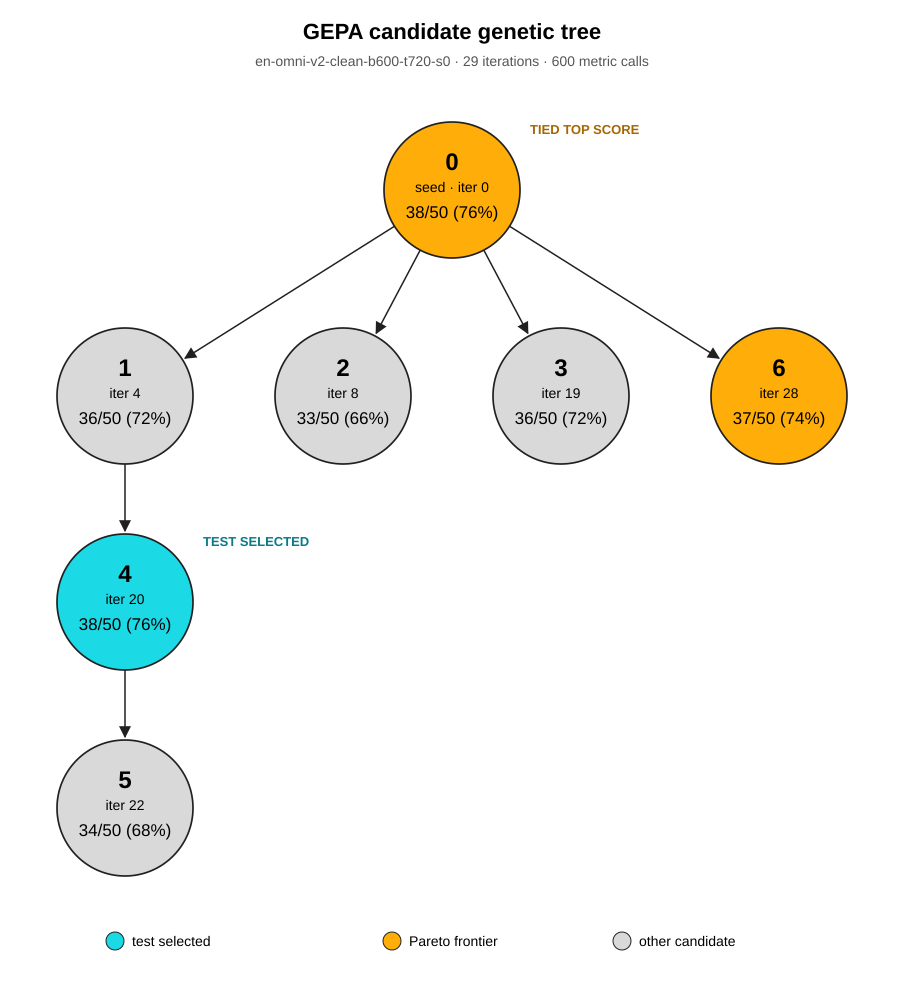

# GEPA 프롬프트 진화 트리: `en-omni-v2-clean-b600-t720-s0`

- 총 **29회 반복**, 제안 **21개**, 평가 호출 **600회**.
- test 평가 선정 후보: **#4** (청록색).
- 공식 GEPA 트리 시각화와 같은 지배 후보 제거 후 Pareto 후보: **3개**. 최종 선정 후보도 이 수에 포함된다.
- 저장된 원시 문항별 최고점 후보의 합집합: **7개**. 모두 틀린 문항에서의 0점 동률도 포함하므로 이 집합을 그대로 색칠하지 않는다.
- 노드의 큰 숫자는 후보 번호다. `iter`는 해당 후보가 채택된 실제 GEPA 반복 번호다.

| 후보 | 채택된 반복 | 부모 | 검증 성적 | Pareto | 최종 선정 |
|---:|---:|---:|---:|:---:|:---:|
| #0 | seed | — | 38/50 (76%) | 예 | 아니요 |
| #1 | 4 | #0 | 36/50 (72%) | 아니요 | 아니요 |
| #2 | 8 | #0 | 33/50 (66%) | 아니요 | 아니요 |
| #3 | 19 | #0 | 36/50 (72%) | 아니요 | 아니요 |
| #4 | 20 | #1 | 38/50 (76%) | 예 | 예 |
| #5 | 22 | #4 | 34/50 (68%) | 아니요 | 아니요 |
| #6 | 28 | #0 | 37/50 (74%) | 예 | 아니요 |

검증 최고 성적은 #0, #4가 동률이다. GEPA 기본 규칙은 먼저 등록된 #0을 선택하지만, 이번 test 평가에서는 사전에 정한 `latest_val_tie` 규칙에 따라 나중에 등록된 #4를 선택했다. 원래 GEPA 결과 파일은 수정하지 않았다.
주황색은 공식 `gepa.visualization.candidate_tree_dot_from_data`가 사용하는 `gepa.gepa_utils.find_dominator_programs`로 정했다. 이는 문항별 최고점 기여가 다른 후보들에 의해 모두 덮이는 후보를 제거한다. 검증 평균 최고점과 Pareto 포함 여부는 서로 다른 기준이다.

근거 파일: 완료된 Modal 실행의 `lineage.json`, `gepa_result.json`, `gepa_state.json`, `summary.json`, `audit.json`. 각 프롬프트 전문은 [클릭 가능한 트리](genetic_tree.html)에서 확인할 수 있다.
