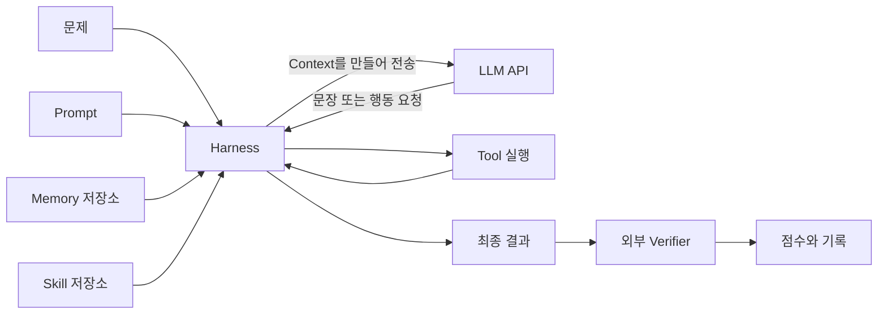
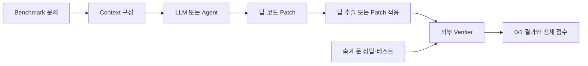
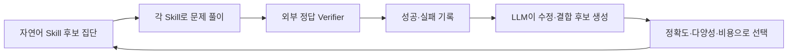
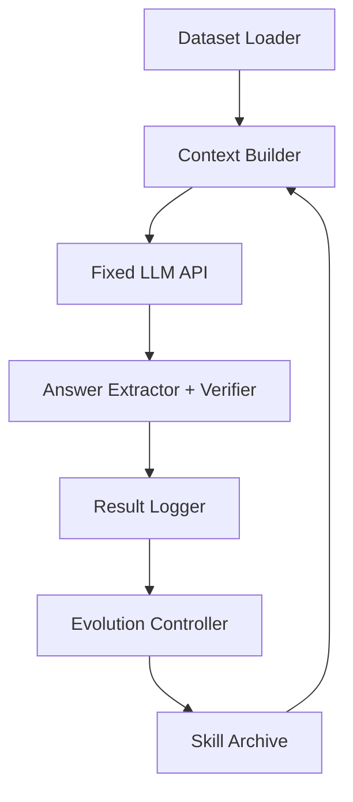

# Self-Evolving LLM Agent를 이해하기 위한 기초

> 대상 독자: LLM의 내부 원리를 처음 접하고, Colab에서 간단한 코드를 실행해 본 팀원  
> 이 문서의 모든 코드 블록은 **호출 구조를 설명하기 위한 수도 코드**다. 그대로 실행하기 위한 코드가 아니다.
> Evolution 중 minibatch·validation 평가와 최종 test의 차이는 [appendix.md](./appendix.md)에서 이어서 설명한다.
> DGM의 진화 tree와 단계별 평가를 그림에 맞춰 읽으려면 [dgm.md](./dgm.md)를 참고한다.

## 이 문서를 읽고 나면 설명할 수 있어야 하는 것

1. LLM API를 한 번 호출할 때 입력과 출력 사이에서 무슨 일이 일어나는가?
2. LLM, agent, harness는 각각 무엇인가?
3. context 안에서 prompt, memory, skill은 어떤 역할을 하는가?
4. LLM이 만든 답을 왜 LLM 바깥에서 평가해야 하는가?
5. AIME와 SWE-bench는 답을 어떻게 채점하는가?
6. API 모델을 다시 학습시키지 않고도 무엇을 “진화”시킬 수 있는가?

문서가 길게 느껴진다면 먼저 `1~7장`에서 LLM agent의 구조를 읽고, `8~11장`에서 benchmark 평가를 확인한 뒤, `12~16장`에서 self-evolution과 프로젝트 구조를 읽는다. `17~20장`은 팀 역할 분담과 복습에 사용할 수 있다.

---

## 1. 전체 그림부터 보기

LLM을 **글을 아주 많이 읽은 학생**이라고 생각해 보자. 학생은 주어진 글을 읽고 답안을 매우 잘 작성할 수 있지만, 혼자서는 다음 일을 할 수 없다.

- 지난번 시험의 일을 자동으로 영원히 기억하기
- 창고에서 지금 필요한 노트를 스스로 꺼내 오기
- 실제 계산기나 코드 실행기를 마음대로 작동시키기
- 자신의 답을 숨겨진 정답표와 비교하기
- 다음 시험부터 사용할 지침을 파일에 저장하기

그래서 학생 주변에 자료를 준비하고, 작업 순서를 관리하고, 도구를 실행하고, 답을 채점하는 프로그램을 둔다. 이 전체 시스템을 **LLM agent**라고 부른다.

| 쉬운 비유 | 실제 요소 | 하는 일 |
|---|---|---|
| 문제를 푸는 학생 | LLM | 입력을 읽고 다음 토큰을 이어서 답을 생성한다. |
| 학생 책상 위의 자료 전부 | Context | 이번 호출에서 LLM이 실제로 읽는 입력이다. |
| 시험의 공통 지시문 | Prompt | 목표, 행동 규칙, 출력 형식을 알려 준다. |
| 과거 경험 노트 | Memory | 이전 실행에서 얻은 사실이나 교훈을 저장한다. |
| 문제 유형별 풀이 안내서 | Skill | 앞으로 다시 사용할 절차나 전략을 저장한다. |
| 계산기·검색기·코드 실행기 | Tool | LLM 바깥에서 실제 행동이나 계산을 수행한다. |
| 자료와 작업 순서를 관리하는 감독관 | Harness | context 구성, API 호출, tool 실행, 반복을 제어한다. |
| 정답표와 채점 프로그램 | Evaluator / Verifier | 생성된 결과가 기준을 만족하는지 판정한다. |

가장 중요한 문장은 다음과 같다.

> **LLM은 답이나 행동 후보를 생성한다. LLM 바깥의 harness는 무엇을 보여 주고 무엇을 실행할지 결정하며, verifier는 결과를 채점한다.**



---

## 2. LLM은 무엇을 하는가?

### 2.1 다음 토큰을 하나씩 만든다

LLM은 입력을 읽고 그 뒤에 올 가능성이 높은 **토큰(token)**을 하나씩 생성한다. 토큰은 단어 전체일 수도 있고, 단어의 일부나 문장부호일 수도 있다.

```text
입력: 대한민국의 수도는
가능성이 높은 다음 토큰: 서울
```

수학 풀이도 근본 원리는 같다.

```text
입력: x² - 5x + 6 = 0을 풀어라.
출력 생성: x² - 5x + 6은 ... → (x-2)(x-3) ... → 따라서 ...
```

LLM이 반드시 방정식 전용 프로그램을 내부에서 실행하는 것은 아니다. 학습 중 익힌 언어·수학 패턴과 현재 입력을 바탕으로 풀이 문장을 이어 간다. 그래서 놀라울 정도로 잘 풀기도 하지만 다음과 같은 일이 생길 수 있다.

- 설명은 자연스럽지만 계산이 틀린다.
- 존재하지 않는 사실을 자신 있게 말한다.
- 같은 입력에도 서로 다른 답을 낼 수 있다.
- 중간 풀이가 틀렸는데 우연히 최종 답만 맞을 수 있다.

즉, **유창한 생성**과 **검증된 정답**은 같은 개념이 아니다.

### 2.2 모델 가중치는 이미 학습된 상태다

LLM 내부에는 학습으로 만들어진 수많은 숫자가 있다. 이를 **모델 가중치(weights)**라고 한다. API로 상용 LLM을 호출하는 프로젝트에서는 보통 이 가중치를 직접 바꾸지 않는다.

한 번 API를 호출했다고 해서 모델이 그 경험을 자동으로 학습하여 다음 날 더 똑똑해지는 것도 아니다. 다음 호출에서 과거 경험을 다시 활용하려면 우리 프로그램이 그 경험을 저장하고 입력에 다시 넣어야 한다.

| 구분 | 모델 가중치 | Context |
|---|---|---|
| 비유 | 교육을 마친 학생의 두뇌 | 이번 시험 때 책상 위에 둔 자료 |
| 만들어지는 시점 | 사전학습, 미세조정, 강화학습 | API를 호출할 때마다 |
| API 프로젝트에서 직접 수정 | 보통 불가능하거나 하지 않음 | 가능 |
| 다음 호출까지 자동 보존 | 모델 버전에 들어 있음 | 보통 프로그램이 다시 제공해야 함 |

이 프로젝트의 핵심은 두뇌를 재학습시키는 것이 아니라, **학생에게 건네는 자연어 자료를 반복적으로 개선하는 것**이다.

---

## 3. API 호출은 원격의 LLM에게 자료를 보내는 일이다

API는 Colab의 프로그램이 외부 서버에 있는 LLM에게 요청을 보내고 응답을 받는 통로다. 특정 회사의 문법을 제거하고 수도 코드로 표현하면 다음과 같다.

```text
context = [
    "일반 지시: 너는 정확한 수학 문제 해결자다.",
    "현재 문제: x² - 5x + 6 = 0을 풀어라."
]

response = LLM_API_CALL(model, context)
print(response.text)
```

호출 한 번의 흐름은 간단하다.

1. 우리 프로그램이 모델에게 보여 줄 context를 만든다.
2. context와 모델 설정을 API 서버로 보낸다.
3. 서버의 LLM이 출력 토큰을 생성한다.
4. 생성된 결과가 우리 프로그램으로 돌아온다.
5. 우리 프로그램이 결과를 저장하거나 외부에서 평가한다.

공식 OpenAI 문서에서도 Python client가 `responses.create(...)`로 요청하고 `response.output_text`를 읽는 동일한 구조를 볼 수 있다. 실제 SDK 문법은 바뀔 수 있으므로 구현 시점에는 [OpenAI API quickstart](https://developers.openai.com/api/docs/quickstart)를 확인한다.

### API가 담당하지 않는 일

단순 API 호출은 보통 다음을 자동으로 보장하지 않는다.

- 답이 사실인지 확인
- 정답과 비교하여 점수 부여
- 과거 실패를 장기 memory에 저장
- 적절한 skill을 찾아 다음 요청에 삽입
- 여러 후보 중 가장 좋은 것을 선택
- 실험 비용과 데이터 분할을 관리

이런 일은 우리가 만든 harness가 담당한다.

---

## 4. Context: 이번 호출에서 LLM이 읽는 모든 것

### 4.1 Context는 마지막 질문만을 뜻하지 않는다

**Context는 한 번의 LLM 호출에서 모델이 실제로 읽을 수 있는 전체 입력**이다. 다음과 같은 여러 조각이 들어갈 수 있다.

```text
[일반 Prompt]
풀이의 근거를 분명히 쓰고, 마지막에 최종 답을 하나만 제시하라.

[선택된 Skill]
이차방정식에서는 인수분해 가능성을 먼저 확인하라.
어렵다면 판별식과 근의 공식을 사용하라.

[검색된 Memory]
이전 풀이에서 정의역 조건을 놓쳤다.
이번에는 구한 해가 원래 조건을 만족하는지 검사하라.

[현재 문제]
x² - 5x + 6 = 0의 모든 실근을 구하여라.

[Tool의 이전 실행 결과]
전개 검사 결과: (x-2)(x-3) = x²-5x+6
```

모델에게는 위 내용이 모두 토큰으로 된 입력이다. `prompt`, `memory`, `skill`이라는 역할은 자연적으로 생기는 것이 아니라 **사람과 harness가 붙인 이름과 사용 규칙**이다.

### 4.2 책상과 창고 비유

- 전체 memory 저장소와 skill 모음은 **창고**에 있다.
- 현재 context는 학생이 볼 수 있는 **책상 위**다.
- harness는 창고에서 필요한 자료를 골라 책상에 올리는 **관리자**다.
- LLM은 책상 위에 올라오지 않은 자료를 읽을 수 없다.

따라서 “memory에 저장했다”와 “이번 답변에서 memory를 사용했다”는 다른 말이다. 저장한 뒤 관련 항목을 검색해 context에 넣어야 실제 영향을 준다.

### 4.3 Context window는 책상의 크기다

LLM이 한 번에 읽고 생성할 수 있는 토큰에는 한도가 있다. 이를 **context window**라고 한다. 책상 크기가 유한한 것과 같다.

Context를 무조건 길게 만들면 다음 문제가 생길 수 있다.

- 입력 토큰과 비용이 증가한다.
- 중요한 지시가 많은 정보 속에 묻힌다.
- 서로 충돌하는 memory나 skill이 함께 들어간다.
- 현재 문제와 무관한 과거 경험이 판단을 흐린다.

그래서 context management의 핵심은 많이 넣는 것이 아니라 **현재 문제에 필요한 내용을 선택하고, 중복을 줄이고, 우선순위를 정하는 것**이다.

---

## 5. Prompt, Memory, Skill은 모두 자연어일 수 있다

세 요소는 구현상 모두 텍스트 파일이나 문자열일 수 있다. 차이는 글자 형태보다 **왜 저장하며 언제 사용하는가**에 있다.

| 요소 | 중심 질문 | 예시 | 일반적인 수명 |
|---|---|---|---|
| Prompt | 모델은 전반적으로 어떻게 행동해야 하는가? | “최종 답을 하나만 명시하라.” | 여러 문제에 공통 적용 |
| Memory | 과거에 무엇을 경험하거나 발견했는가? | “지난 풀이에서 양의 정수 조건을 놓쳤다.” | 실행 중 추가·수정 가능 |
| Skill | 이런 유형의 문제를 어떻게 풀 것인가? | “대칭식은 기본대칭식으로 바꿔 보라.” | 문제 유형별로 반복 사용 |
| 현재 요청 | 지금 무엇을 해야 하는가? | “이 문제를 풀어라.” | 현재 작업에 한정 |
| Tool 결과 | 외부 실행에서 무엇을 관찰했는가? | “테스트 3개 중 1개 실패” | 다음 판단을 위해 일시 삽입 |

### 5.1 Prompt: 공통 행동 지시

```text
너는 수학 문제 해결자다.
근거 없는 가정을 하지 말고, 마지막에 최종 답을 명확히 표시하라.
```

논문마다 `prompt`를 전체 입력이라는 넓은 의미로 쓰기도 한다. 이 프로젝트에서는 혼동을 줄이기 위해 다음처럼 정의할 수 있다.

> Prompt는 context 안에서 모델의 일반적인 목표, 행동 규칙, 출력 형식을 알려 주는 부분이다.

### 5.2 Memory: 과거 사건이나 교훈의 기록

```text
문제 17에서 x > 0 조건을 확인하지 않아 음수 해까지 제출했다.
다음부터 최종 해를 원래 조건과 대조해야 한다.
```

Memory는 모델의 두뇌에 저절로 기록되는 기억이 아니다. 이 프로젝트에서는 텍스트, 표, JSON 파일 또는 데이터베이스에 저장된 **외부 기록**이라고 보면 된다. 일부 문헌은 현재 대화 기록을 `short-term memory`라고도 부른다. 이 문서에서는 용어를 분명히 하기 위해, 다음 호출에도 다시 사용할 목적으로 외부에 남긴 기록을 주로 memory라고 부른다.

### 5.3 Skill: 앞으로 재사용할 절차

```text
Skill 이름: 방정식 해 검증

1. 대수적으로 후보 해를 구한다.
2. 후보를 원래 식에 대입한다.
3. 정의역과 정수·양수 같은 추가 조건을 확인한다.
4. 부적합한 해를 제거하고 최종 답을 작성한다.
```

자연어로만 된 skill은 **이름, 적용 조건, 목적이 붙은 재사용 가능한 prompt 조각**이라고 볼 수 있다. 어떤 시스템에서는 skill에 실행 코드나 도구까지 포함하지만, 이 프로젝트는 자연어 skill만 진화시켜도 충분히 성립한다.

### 5.4 Memory가 Skill이 될 수 있다

경계가 항상 완벽히 고정되는 것은 아니다.

```text
Memory: 문제 17에서 정의역을 놓쳐 틀렸다.
                      ↓ 여러 실패에서 공통점을 일반화
Skill: 방정식의 후보 해를 원래 정의역과 반드시 대조하라.
```

실용적인 구분은 다음과 같다.

- 특정 실행에서 있었던 사건은 **memory**
- 여러 새로운 문제에도 적용할 일반 절차는 **skill**

### 5.5 RAG: 창고에서 관련 자료를 찾는 방법

RAG(Retrieval-Augmented Generation)는 외부 문서 저장소에서 현재 질문과 관련된 내용을 검색하여 context에 넣는 방식이다. 도서관 사서가 질문에 맞는 책의 몇 쪽을 골라 학생 책상에 올려 주는 것과 같다.

```text
현재 문제 → 관련 문서 검색 → 상위 몇 개 문서 선택 → Context에 삽입 → LLM 호출
```

RAG는 저장소 자체도 아니고 모델 학습도 아니다. **필요한 외부 정보를 찾아 context로 가져오는 절차**다. Memory를 검색할 때도 RAG와 비슷한 검색 기법을 사용할 수 있지만, 둘의 관점은 다르다.

- Memory는 “무엇을 과거 경험으로 저장했는가?”에 초점을 둔다.
- RAG는 “현재 요청에 관련된 자료를 어떻게 찾아 넣는가?”에 초점을 둔다.

---

## 6. Agent와 Harness

### 6.1 Agent는 특별한 종류의 LLM 이름이 아니다

한 번 질문하고 한 번 답을 받으면 단순한 LLM 호출이다. Agent는 LLM이 상황을 보고, 행동을 제안하고, 외부 결과를 다시 읽으며 작업을 이어 가게 만든 **전체 시스템**을 뜻한다.

Harness는 그 시스템을 실제로 운영하는 제어 코드다. 예를 들어 다음 일을 한다.

1. 현재 문제를 읽는다.
2. 관련 memory와 skill을 고른다.
3. context를 조립한다.
4. LLM API를 호출한다.
5. LLM이 요청한 tool이 있으면 외부에서 실행한다.
6. 실행 결과를 context에 추가한다.
7. 끝날 때까지 반복한다.
8. 최종 결과를 verifier에 전달한다.

```text
문제 = LOAD_NEXT_PROBLEM()
memory = RETRIEVE_RELEVANT_MEMORY(문제)
skill = SELECT_RELEVANT_SKILL(문제)
context = BUILD_CONTEXT(prompt, memory, skill, 문제)

반복:
    response = LLM_API_CALL(context)

    만약 response가 tool 사용을 요청하면:
        result = RUN_TOOL_OUTSIDE_LLM(response.tool_request)
        context에 result를 추가
    아니면:
        최종 답 = response
        반복 종료

score = VERIFY_OUTSIDE_LLM(최종 답)
```

### 6.2 LLM은 tool을 직접 실행하는 것이 아니다

LLM이 계산기를 사용한다고 말할 때 실제 과정은 다음과 같다.

```text
LLM: calculator(expression="17 × 23")를 사용하고 싶다.
        ↓
Harness: 실제 계산기 함수를 실행한다.
        ↓
Tool: 391을 반환한다.
        ↓
Harness: "계산 결과는 391"을 context에 추가한다.
        ↓
LLM: 그 결과를 읽고 최종 답을 작성한다.
```

모델은 **행동을 제안**하고 프로그램은 **행동을 실행**한다. 이 구분은 코드 benchmark에서 특히 중요하다. LLM이 “테스트를 실행하겠다”고 말하는 것과 실제로 격리된 환경에서 테스트가 실행되는 것은 전혀 다르다.

### 6.3 Agent harness와 evaluation harness

`harness`는 문맥에 따라 두 의미로 쓰인다.

- **Agent harness**: context를 만들고 tool을 실행하며 agent의 작업 순서를 제어한다.
- **Evaluation harness**: 모든 모델의 결과를 같은 규칙과 환경에서 채점한다.

SWE-bench의 “harness”는 주로 두 번째 의미다. 저장소와 Docker 환경을 준비하고, 제출된 patch를 적용하고, 테스트를 실행해 통과 여부를 기록한다.

---

## 7. 왜 평가는 LLM 바깥에서 이루어져야 하는가?

LLM에게 자신의 답을 평가하라고 물으면 다음과 같이 말할 수 있다.

```text
LLM: 제 풀이는 논리적이고 최종 답 137이 맞습니다.
```

하지만 자신감 있는 문장은 정답 증거가 아니다. 정답이 `142`라면 외부 채점기는 바로 0점을 줘야 한다.

```text
모델의 주장: "맞았다"
외부 비교: 137 != 142
판정: 실패
```

여기서 **verifiable**하다는 말은 사람이 읽었을 때 좋아 보인다는 뜻이 아니다. 미리 정한 절차로 결과를 확인할 수 있다는 뜻이다.

- 수학: 추출한 최종 답을 정답과 비교한다.
- 코드: patch를 실제 저장소에 적용하고 테스트를 실행한다.
- 퍼즐: 생성 결과가 모든 제약 조건을 만족하는지 검사한다.

Verifier도 완벽하지는 않다. 최종 답만 비교하면 풀이 과정의 오류나 접근법의 가치는 판단하지 못하고, 코드 테스트가 부족하면 잘못된 patch가 우연히 통과할 수도 있다. 따라서 “자동 검증 가능”과 “과제의 모든 품질을 완벽히 측정함”은 구분해야 한다.

---

## 8. Benchmark 실험의 공통 구조

Benchmark는 모델이나 agent를 같은 조건에서 비교하기 위한 **문제 모음과 평가 규칙**이다.

각 항목은 대략 다음 구조를 가진다.

```text
benchmark_item = {
    input: 모델에게 공개되는 문제,
    hidden_reference: 모델에게 공개하지 않는 정답 또는 테스트,
    verifier: 제출 결과와 reference를 비교하는 규칙
}
```

평가 흐름은 다음과 같다.



중요한 원칙은 **생성기와 채점기의 분리**다.

- LLM/agent는 후보를 만든다.
- verifier는 정해진 규칙으로 후보를 판정한다.
- optimizer는 그 점수를 사용해 prompt나 skill을 고친다.

---

## 9. AIME형 수학 Benchmark는 어떻게 평가되는가?

### 9.1 문제와 정답의 형태

AIME는 15개의 어려운 수학 문제로 이루어진 시험이며, 각 문제의 답은 `0`부터 `999` 사이의 정수다. 공식 형식은 [MAA의 AIME 안내](https://maa.org/maa-invitational-competitions/)에서 확인할 수 있다. 연구에서는 주로 여러 해의 과거 AIME 문제를 모아 reasoning benchmark로 사용한다.

다음은 구조를 보여 주기 위한 가상의 AIME형 문제다.

```text
문제: 양의 정수 x가 x + 7 = 19를 만족한다. x를 구하여라.
숨겨 둔 정답: 012
```

모델에게는 문제만 보여 주고 정답은 보여 주지 않는다.

```text
입력 Context:
- 일반 지시: 풀이 후 FINAL: 세 자리 정수 형식으로 답하라.
- 선택된 Skill: 식을 정리한 뒤 원래 식에 대입해 검산하라.
- 현재 문제: 양의 정수 x가 x + 7 = 19를 만족한다. x를 구하여라.

모델 출력:
x = 19 - 7 = 12이다. 대입하면 12 + 7 = 19이므로 맞다.
FINAL: 012
```

### 9.2 외부 채점 수도 코드

```text
맞힌_문제_수 = 0

각 문제에 대해:
    output = AGENT_SOLVE(문제)
    predicted = EXTRACT_ONE_FINAL_INTEGER(output)

    만약 predicted를 추출하지 못하면:
        판정 = 실패
    아니고 predicted == 숨겨_둔_정답이면:
        판정 = 성공
        맞힌_문제_수 += 1
    그 외에는:
        판정 = 실패

accuracy = 맞힌_문제_수 / 전체_문제_수
```

여기서 정답 비교는 LLM이 하지 않는다. `EXTRACT`와 `==` 비교는 harness 안의 일반 프로그램이 수행한다.

### 9.3 답 추출 규칙도 실험의 일부다

모델 출력에는 중간 계산 숫자가 많이 등장한다. “출력에 정답 숫자가 한 번이라도 있으면 성공”으로 판정하면 다음과 같은 답이 잘못 통과할 수 있다.

```text
가능한 답은 011, 012, 013 중 하나다.
```

그래서 보통 다음과 같은 규칙을 정한다.

- `FINAL:` 또는 `\boxed{}` 안의 답 하나만 읽는다.
- 최종 답을 둘 이상 쓰면 parsing 실패로 처리한다.
- 허용 범위와 형식을 확인한다.
- parsing 실패율을 정확도와 별도로 기록한다.

AIME처럼 정수 답이면 비교가 단순하다. 일반 수학 benchmark에서는 `1/2`, `0.5`, `2/4`가 같은 값을 뜻하므로 문자열 비교만으로 부족하다. 그런 경우 수식을 표준화하거나 symbolic equivalence checker를 사용한다. 이 검사기도 정의역, 복수 해, 단위 같은 경우에는 실수할 수 있으므로 일부 결과를 사람이 점검해야 한다.

### 9.4 정답 채점이 알려 주지 않는 것

최종 답 exact match는 다음 질문에는 답하지 못한다.

- 풀이가 논리적으로 올바른가?
- 우연히 정답을 맞혔는가?
- 인수분해와 근의 공식처럼 실제로 다른 접근을 사용했는가?
- 풀이가 학생에게 이해 가능한가?

따라서 프로젝트에서는 두 층을 분리하는 것이 좋다.

| 평가 층 | 예 | 성격 |
|---|---|---|
| 핵심 성능 | 최종 답 정답 여부 | 규칙 기반으로 강하게 검증 가능 |
| 연구 분석 | 올바른 풀이 전략의 종류와 수 | rubric, 사람 검토, 보조 LLM judge 필요 |

다양성 judge의 판단을 곧바로 절대적인 정답처럼 취급해서는 안 된다. 사람의 일부 표본 검토로 judge가 “표현만 다른 같은 방법”을 별개 전략으로 잘못 세지 않는지 확인해야 한다.

---

## 10. SWE-bench는 어떻게 평가되는가?

### 10.1 정답 문자열 대신 실제 프로그램을 실행한다

SWE-bench는 실제 GitHub issue와 코드 저장소를 바탕으로 “이 버그를 고쳐라”라는 작업을 준다. 최초 논문은 12개 Python 저장소에서 수집한 2,294개 문제로 평가 틀을 제시했다. 자세한 정의는 [SWE-bench 논문](https://arxiv.org/abs/2310.06770)에서 볼 수 있다.

한 문제의 개념적 구성은 다음과 같다.

```text
[모델에게 주는 것]
- GitHub issue 설명
- 버그가 있던 시점의 코드 저장소

[agent가 하는 것]
- 파일 검색
- 코드 읽기
- 수정할 위치 결정
- 코드 변경
- 필요하면 로컬 테스트 실행

[최종 제출]
- 어떤 줄을 어떻게 바꿀지 나타내는 code patch
```

SWE-bench에서는 정답 patch와 글자가 똑같은지 비교하지 않는다. 같은 버그를 고치는 올바른 구현은 여러 개일 수 있기 때문이다. 대신 제출 patch를 실제 코드에 적용한 뒤 테스트를 실행한다.

### 10.2 외부 평가 과정

```text
저장소 = LOAD_REPOSITORY_AT_BASE_COMMIT(문제)
APPLY_PATCH(저장소, agent가_제출한_patch)

격리된_환경 = PREPARE_CONTAINER(저장소, 정해진_의존성)
test_result = RUN_REQUIRED_TESTS(격리된_환경)

만약 고쳐야 할 테스트가 통과하고
기존에 통과하던 기능도 계속 통과하면:
    판정 = RESOLVED
그 외에는:
    판정 = FAILED
```

이 두 종류의 테스트는 흔히 다음 이름으로 설명한다.

| 테스트 종류 | 수정 전 | 올바른 수정 후 | 확인하는 것 |
|---|---:|---:|---|
| `FAIL_TO_PASS` | 실패 | 통과 | 보고된 버그를 실제로 고쳤는가? |
| `PASS_TO_PASS` | 통과 | 계속 통과 | 기존 기능을 망가뜨리지 않았는가? |

두 조건을 모두 만족해야 완전히 해결된 것으로 판정한다. 버그 테스트만 통과하도록 다른 기능을 삭제한 patch는 성공이 아니다.

공식 평가 도구는 재현 가능한 실행 환경을 위해 Docker container를 사용한다. 설치와 실제 평가 명령의 현재 형태는 [SWE-bench quickstart](https://www.swebench.com/SWE-bench/guides/quickstart/)에서 확인할 수 있다.

### 10.3 왜 Docker 같은 격리 환경이 필요한가?

같은 코드도 Python 버전, 라이브러리 버전, 운영체제가 다르면 결과가 달라질 수 있다. 모든 제출을 가능한 한 같은 조건에서 평가해야 공정하게 비교할 수 있다.

Container는 각 문제에 필요한 코드와 의존성을 담은 **시험장**과 같다.

- 모델이나 agent: 답안인 patch를 작성한다.
- evaluation harness: 같은 시험장을 준비한다.
- unit test: patch가 요구사항을 만족하는지 검사한다.

### 10.4 AIME와 다른 점

| 항목 | AIME형 수학 평가 | SWE-bench형 코드 평가 |
|---|---|---|
| 모델이 제출하는 것 | 최종 정수 답 | 코드 변경 patch |
| 숨겨 둔 기준 | 정답 숫자 | 실행할 테스트와 기대 동작 |
| 평가 동작 | 정규화 후 값 비교 | patch 적용 후 코드 실행 |
| 대표 점수 | Accuracy, pass@1 | Resolved rate |
| 하나의 문제 비용 | 비교적 작음 | 저장소 준비와 테스트 때문에 큼 |
| 주요 함정 | 답 추출 오류, 우연한 정답 | 환경 오류, 불충분한 테스트, patch 적용 실패 |

두 benchmark의 공통점은 모델의 자기평가를 그대로 믿지 않고 **외부의 명시적 절차로 성공 여부를 결정한다는 점**이다.

---

## 11. “Rule-based처럼 검증한다”는 말의 정확한 의미

외부 평가는 보통 조건문과 실행 결과로 이루어진다.

```text
수학: predicted_answer == gold_answer 인가?
코드: required_tests가 모두 통과했는가?
퍼즐: 모든 제약식을 만족하는가?
```

이런 신호는 반복 실험에 유리하다.

- 같은 출력에는 같은 점수를 줄 수 있다.
- 많은 문제를 자동으로 채점할 수 있다.
- 자연어 지침을 바꾸었을 때 점수 변화를 비교할 수 있다.
- evolution 과정에 `0/1` 또는 숫자 fitness를 제공할 수 있다.

하지만 verifier가 현실의 모든 의미를 이해하는 것은 아니다.

- 최종 숫자가 맞아도 풀이가 틀렸을 수 있다.
- 테스트가 약하면 잘못된 코드가 통과할 수 있다.
- “서로 다른 수학적 접근”은 단순 문자열 규칙으로 판단하기 어렵다.

따라서 지표를 다음처럼 나누면 혼동이 줄어든다.

| 종류 | 예 | 프로젝트에서의 역할 |
|---|---|---|
| Hard / verifiable metric | 정답 일치, 테스트 통과 | 주된 성능 점수와 selection 신호 |
| Soft / interpretive metric | 풀이 전략 다양성, 설명 품질 | 연구 분석과 보조 목표 |
| 운영 metric | 호출 수, 토큰 수, 비용, 시간 | 같은 예산에서의 효율 비교 |

---

## 12. 자연어 기반 Self-Evolving Agent

### 12.1 무엇이 진화하는가?

API 기반 프로젝트에서는 LLM 가중치를 고정한 채 다음과 같은 외부 요소를 수정할 수 있다.

- 일반 prompt
- 문제 유형별 skill
- 실패에서 추출한 memory
- 어떤 skill을 어떤 문제에 선택할지에 관한 규칙
- 여러 후보를 보존하고 조합하는 방식

우리 프로젝트를 가장 정확하게 표현하면 다음과 같다.

> **고정된 API LLM을 사용하면서, 수학 풀이 전략을 적은 자연어 skill 후보들을 생성·수정·평가·선택하여 새로운 문제에서 정답률과 올바른 접근법 다양성이 향상되는지 조사한다.**

### 12.2 진화의 기본 반복

같은 API 모델이 서로 다른 호출에서 두 역할을 맡을 수도 있다.

```text
[Solver 호출]
현재 skill과 수학 문제를 읽고 풀이를 생성한다.
        ↓
[외부 Verifier]
최종 답을 정답과 비교해 0점 또는 1점을 돌려준다.
        ↓
[Optimizer 호출]
기존 skill, 실패한 풀이, 점수를 읽고 개선된 skill 문장을 제안한다.
        ↓
[Harness]
새 skill을 파일에 저장하고 다음 문제들에서 다시 평가한다.
```

Solver와 optimizer가 같은 LLM일 수 있지만 **한 번의 생각 속에서 저절로 진화하는 것은 아니다**. Harness가 역할별 context를 따로 만들고 API를 여러 번 호출하며, 그 사이에 외부 점수와 파일 저장을 연결한다.



수도 코드로는 다음 정도면 충분하다.

```text
archive = 초기 skill 여러 개

여러 generation 동안 반복:
    candidates = LLM이 archive를 수정·결합하여 만든 새 skill들

    각 candidate에 대해:
        같은 evolution 문제들을 풀게 함
        correctness = 외부 정답 verifier로 계산
        approach_diversity = 별도 rubric과 표본 검토로 분석
        cost = 사용한 호출·토큰 기록

    archive = 정확하면서 서로 보완적인 candidate들을 선택

모든 설계가 끝난 뒤:
    archive를 고정
    한 번도 사용하지 않은 test 문제로 최종 평가
```

여기에서 LLM은 새 skill 문장을 만드는 **후보 생성자**다. 무엇이 살아남는지는 harness와 evaluator가 결정한다.

### 12.3 작은 Skill population 예시

초기 후보를 다음처럼 만들 수 있다.

```text
Skill A — 직접 계산
식을 표준형으로 정리하고 가장 직접적인 계산으로 답을 구한 뒤 검산하라.

Skill B — 여러 접근 탐색
계산 전에 가능한 풀이 접근을 두 가지 제안하고, 핵심 수학 도구가 실제로 다른지 확인하라.

Skill C — 구조 탐색
공식부터 적용하기 전에 대칭성, 인수분해, 치환, 불변량이 있는지 찾아라.

Skill D — 오류 검증
풀이 후 부호, 정의역, 빠진 해, 중복된 해를 별도의 단계에서 검사하라.
```

예를 들어 Skill B가 다음과 같이 실패했다고 하자.

- 사실상 같은 대수 풀이를 말만 바꾸어 두 번 제시했다.
- 두 방법을 길게 쓰다가 계산 실수가 늘었다.
- 접근 탐색에는 성공했지만 최종 조건 검사가 빠졌다.

그 실패 기록을 context에 넣고 새 후보를 요청할 수 있다.

```text
기존 장점인 접근 탐색은 유지하라.
후보는 최대 두 개만 만들고, 사용하는 핵심 수학 도구가 다른지 확인하라.
더 짧고 검증하기 쉬운 방법 하나를 선택해 완결된 계산을 수행하라.
마지막에는 모든 조건을 다시 검사하라.
```

이렇게 자연어 지침이 바뀌는 것이 이 프로젝트에서의 **skill evolution**이다.

### 12.4 가능한 변화 연산

- **Mutation**: 한 skill의 일부를 수정한다.
- **Reflection**: 실패 사례를 읽고 보완한다.
- **Recombination**: 서로 다른 두 skill의 장점을 합친다.
- **Compression**: 너무 길고 중복된 지침을 짧게 만든다.
- **Specialization**: 대수, 기하, 조합 등 특정 문제군용으로 나눈다.
- **Generalization**: 여러 memory에서 반복되는 교훈을 일반 skill로 만든다.

---

## 13. 정확도와 탐색 다양성을 함께 평가하기

이 프로젝트가 원하는 다양성은 문장 표현의 다양성이 아니라 **수학적 접근법의 다양성**이다.

```text
"근의 공식을 사용한다."
"quadratic formula를 이용한다."
→ 표현만 다르고 같은 접근

"인수분해로 근을 구한다."
"근의 공식을 사용한다."
"그래프와 x축의 교점을 이용한다."
→ 사용한 수학적 도구와 구조가 다른 접근
```

또한 틀린 풀이를 많이 만드는 것은 유용한 탐색이라고 보기 어렵다. 핵심 지표를 다음처럼 설계할 수 있다.

| 지표 | 묻는 질문 |
|---|---|
| pass@1 / Accuracy | 한 번의 최종 풀이가 맞는가? |
| Oracle pass@k | k개 후보 중 하나라도 정답이 있는가? |
| Correct strategy coverage@k | k개 후보 안에 서로 다른 **올바른** 접근이 몇 개 있는가? |
| Selection accuracy@k | 후보 중 최종 선택기가 실제 정답을 골랐는가? |
| Cost | 그 결과를 위해 호출과 토큰을 얼마나 썼는가? |

`k`번 시도하면 한 번보다 맞힐 확률이 자연스럽게 높아질 수 있다. 따라서 evolved skill 집단을 k번 호출했다면 baseline도 같은 모델 호출 수와 비슷한 출력 토큰 예산을 주어야 한다.

```text
공정하지 않은 비교:
baseline 한 번 호출 vs evolved skills 열 번 호출

더 공정한 비교:
같은 prompt를 열 번 샘플링 vs evolved skills 열 개로 한 번씩 풀이
```

그래야 향상이 단순히 더 많은 API 호출 때문인지, 서로 다른 유용한 풀이 전략 때문인지 구분할 수 있다.

---

## 14. 데이터를 세 부분으로 나누는 이유

자연어 skill을 같은 문제에 계속 적용하고 고치면 그 문제에 과적합할 수 있다. 데이터를 다음처럼 나눈다.

| 데이터 | 사용 목적 | Skill 수정에 결과를 사용해도 되는가? |
|---|---|---|
| Evolution / Train | 실패를 관찰하고 새 후보를 만든다. | 예 |
| Validation / Dev | 후보 선택, 설정 비교, 중단 시점을 결정한다. | 제한적으로 예 |
| Held-out Test | 모든 설계를 끝낸 뒤 최종 성능을 보고한다. | 아니오 |

Test 점수를 본 뒤 skill을 다시 고치면 그 문제는 더 이상 “처음 보는 시험 문제”가 아니다. 최종 test는 archive, prompt, selection rule을 모두 고정한 뒤 수행해야 한다.

SWE-bench에서도 agent가 공식 test의 실패 메시지를 몇 번까지 볼 수 있는지, 테스트를 개발 중에 사용할 수 있는지에 따라 실험 조건이 달라진다. 어떤 정보를 agent에게 공개했는지를 보고서에 분명히 써야 한다.

### 최소 실험 기록

점수만 남기면 어떤 자연어 요소가 결과를 만들었는지 되살릴 수 없다. 적어도 다음 항목은 문제별로 저장한다.

| 항목 | 저장하는 이유 |
|---|---|
| 문제 ID와 데이터 분할 | 어떤 문제를 진화와 최종 평가에 썼는지 확인 |
| API 모델과 실행 날짜 | 서비스 모델의 버전·동작 변화에 대비 |
| Prompt·memory·skill 전문과 버전 | 모델이 실제로 읽은 context를 재구성 |
| 원본 LLM 출력 | 답 추출과 실패 원인을 다시 검사 |
| 추출된 최종 답과 verifier 결과 | 생성과 채점 단계를 분리해 확인 |
| 호출 횟수, 입력·출력 토큰, 비용 | 같은 예산에서 방법을 비교 |
| 다양성 분류와 검토자 | 접근법 판정의 근거를 추적 |

---

## 15. Self-Evolution에서 자주 생기는 함정

### 15.1 Evaluator gaming

Optimizer는 연구자의 의도를 읽는 것이 아니라 **점수를 주는 규칙**에 적응한다.

예를 들어 parser가 출력에 정답이 포함되기만 하면 성공 처리할 경우, 여러 숫자를 나열하는 skill이 높은 점수를 받을 수 있다. 다양성 judge가 문장 차이에 쉽게 속는다면 동의어만 바꾸는 skill이 살아남을 수 있다.

예방 방법은 다음과 같다.

- 최종 답을 정확히 하나만 허용한다.
- parsing 실패를 별도로 기록한다.
- 다양성은 정답인 풀이 사이에서 측정한다.
- LLM judge의 일부 판정을 사람이 표본 검토한다.
- 최종 평가는 진화에 사용하지 않은 문제로 한다.

### 15.2 호출 수가 만드는 착시

후보 수, 문제 수, 세대 수, 반복 횟수를 모두 곱하면 풀이 호출 수가 된다.

```text
총 풀이 호출 수 ≈ skill 후보 수 × 문제 수 × generation 수 × 반복 횟수
```

여기에 새 skill을 만드는 optimizer 호출, 접근법을 분류하는 judge 호출, 최종 선택 호출이 추가된다. 작은 pilot으로 시작하고 모든 실험에 호출 수·토큰·비용을 함께 기록해야 한다.

### 15.3 Benchmark 점수와 실제 능력의 혼동

Benchmark는 측정 도구다. 점수가 올랐다고 해서 모든 수학 능력이나 모든 코드 작성 능력이 좋아졌다고 단정할 수 없다.

- 특정 문제 유형에만 잘 맞는 skill일 수 있다.
- 번역 표현이나 답 형식에 적응했을 수 있다.
- verifier의 빈틈을 이용했을 수 있다.
- 더 많은 추론 호출을 사용했을 수 있다.

그래서 문제 유형별 결과, 비용, parsing 실패, 실제 풀이 사례를 함께 보고하는 것이 좋다.

---

## 16. 프로젝트의 최소 구성

이 프로젝트를 거대한 agent 시스템으로 만들 필요는 없다. 다음 여섯 부분이면 연구 질문을 검증할 수 있다.

```text
1. Dataset Loader
   문제와 숨겨 둔 정답을 읽는다.

2. Natural-language Skill Archive
   여러 풀이 지침을 텍스트로 저장한다.

3. Context Builder
   공통 prompt + 선택된 skill + 문제를 조립한다.

4. LLM API Caller
   고정된 모델에 context를 보내고 출력을 받는다.

5. Verifier and Logger
   최종 답을 추출·채점하고 비용과 결과를 저장한다.

6. Evolution Controller
   실패를 바탕으로 새 skill을 만들고 다음 세대 후보를 선택한다.
```



여기서 모델은 고정되어 있고, 주요 연구 대상은 `Skill Archive`의 자연어 내용과 `Evolution Controller`의 선택 방식이다.

---

## 17. 비전공자 팀원이 맡을 수 있는 핵심 작업

이 연구는 코드만으로 이루어지지 않는다. 자연어 요소와 평가 설계가 핵심이므로 다음 작업은 연구적으로 중요하다.

| 작업 | 구체적인 질문 |
|---|---|
| Skill 초안 작성 | 서로 실제로 다른 수학적 접근을 유도하는가? |
| 실패 사례 분류 | 계산 오류, 조건 누락, 전략 선택 오류 중 무엇인가? |
| 다양성 rubric 설계 | 표현 차이와 접근법 차이를 어떻게 구분할 것인가? |
| Judge 표본 검토 | 자동 분류가 사람 판단과 일치하는가? |
| 데이터 검수 | 정답과 번역, 난이도, 문제 유형이 적절한가? |
| 실험 기록 | 모델, prompt 버전, skill, 호출 수, 점수를 빠짐없이 남겼는가? |
| 사례 연구 | 어떤 sub-optimal skill이 훗날 유용한 stepping stone이 되었는가? |

비전공자 팀원도 “좋아 보이는 문장 만들기”에 머무르지 않고, **명확한 rubric으로 자연어 전략을 설계하고 실패를 분석하는 연구자 역할**을 맡을 수 있다.

---

## 18. 자주 하는 오해

### “LLM은 대화를 자동으로 영구 기억한다.”

보통 그렇지 않다. 외부 시스템이 기록을 저장하고 다음 context에 다시 넣어야 한다.

### “Context는 채팅 기록이다.”

채팅 기록은 context의 일부일 수 있다. Prompt, memory, skill, 현재 문제, tool 결과도 모두 context에 들어갈 수 있다.

### “Memory와 skill은 모델 안에 저장된다.”

이 프로젝트에서는 LLM 바깥의 자연어 파일이나 데이터다. 선택되어 context에 들어간 항목만 모델이 읽는다.

### “Tool 설명을 주면 LLM이 직접 실행한다.”

LLM은 tool 호출을 요청한다. 실제 함수나 프로그램을 실행하는 주체는 harness다.

### “Agent는 LLM의 다른 이름이다.”

Agent는 보통 LLM에 context 관리, tool 실행, memory, 반복 제어를 결합한 시스템이다.

### “Self-evolving이면 모델을 다시 학습한다.”

API 기반 연구에서는 모델 가중치를 고정한 채 prompt, memory, skill 같은 외부 자연어 요소를 진화시킬 수 있다.

### “긴 context일수록 좋다.”

관련 없는 내용은 비용을 높이고 지시 충돌을 일으킬 수 있다. 선택과 압축이 필요하다.

### “최종 답이 맞으면 풀이 방법도 좋다.”

정답 정확도와 접근법의 타당성·다양성은 별도 평가 대상이다.

### “서로 다른 문장이면 서로 다른 전략이다.”

표현만 다를 수 있다. 실제로 사용한 수학 도구, 문제 표현, 핵심 전개가 달라야 접근법 다양성이라고 볼 수 있다.

---

## 19. 핵심 용어 사전

| 용어 | 한 문장 정의 |
|---|---|
| Token | LLM이 읽고 생성하는 텍스트의 작은 단위 |
| Model weights | 학습을 통해 만들어진 LLM 내부의 수치 파라미터 |
| API | 우리 프로그램이 외부 LLM 서버에 요청하고 응답받는 통로 |
| Context | 한 번의 호출에서 LLM이 실제로 읽는 전체 입력 |
| Context window | 한 번에 처리할 수 있는 입력과 출력 토큰의 한도 |
| Prompt | 모델의 목표, 행동 규칙, 출력 형식을 적은 지시 |
| Memory | 과거 실행에서 얻은 사건·사실·교훈의 외부 기록 |
| Skill | 특정 유형의 작업에 다시 사용할 절차나 전략 |
| Tool | 검색, 계산, 코드 실행처럼 LLM 바깥에서 작동하는 기능 |
| Agent | LLM과 context, tool, memory, 반복 제어가 결합된 시스템 |
| Harness | agent 또는 평가 과정을 실제로 운영하는 제어 프로그램 |
| Evaluator / Verifier | 결과가 정해진 기준을 만족하는지 판정하는 장치 |
| Benchmark | 비교를 위한 문제 모음과 평가 규칙 |
| Patch | 코드의 어느 부분을 어떻게 바꿀지 나타내는 변경 내용 |
| Population | 동시에 관리하는 여러 prompt 또는 skill 후보의 집합 |
| Mutation | 기존 후보 일부를 수정하여 새 후보를 만드는 연산 |
| Fitness | 후보를 선택하기 위해 계산한 성능 점수 |
| Held-out test | 설계와 진화에 사용하지 않고 마지막에만 쓰는 평가 문제 |

---

## 20. 한 문장씩 다시 정리하기

1. **LLM**은 context를 읽고 답을 생성한다.
2. **API**는 우리 프로그램과 원격 LLM을 연결한다.
3. **Context**는 이번 호출 때 LLM의 책상 위에 놓인 모든 자료다.
4. **Prompt**는 공통 지시, **memory**는 과거 기록, **skill**은 재사용할 절차다.
5. **Harness**는 이 자료를 조립하고 API·tool·반복을 관리한다.
6. **Verifier**는 LLM 바깥에서 수학 답을 비교하거나 코드 테스트를 실행한다.
7. **Self-evolution**은 그 점수를 이용해 외부 자연어 skill을 반복적으로 개선하는 과정이다.
8. 이 프로젝트의 성패는 높은 정확도뿐 아니라 **같은 비용에서 실제 수학 접근법의 올바른 다양성이 증가했는지**로 판단해야 한다.

---

## 참고 자료

- [OpenAI API Developer Quickstart](https://developers.openai.com/api/docs/quickstart): API 요청과 응답의 실제 형태
- [MAA Invitational Competitions — AIME](https://maa.org/maa-invitational-competitions/): AIME의 공식 문제·답 형식
- [SWE-bench 논문 — Can Language Models Resolve Real-World GitHub Issues?](https://arxiv.org/abs/2310.06770): benchmark의 문제 구성과 평가 목적
- [SWE-bench Quickstart](https://www.swebench.com/SWE-bench/guides/quickstart/): Docker 기반 공식 evaluation harness의 현재 사용 구조
